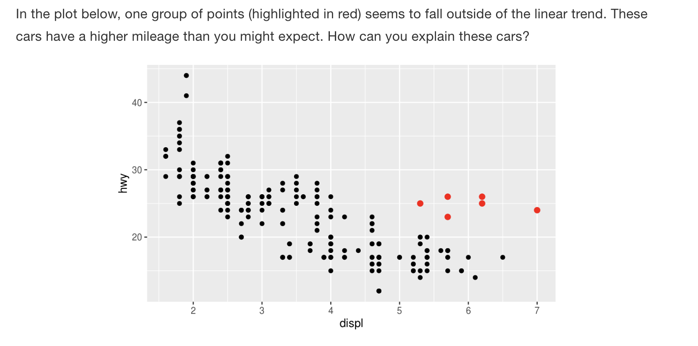
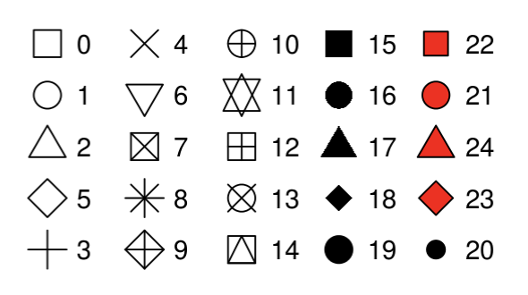

```{r setup, include=FALSE}
knitr::opts_chunk$set(echo = TRUE)
library(tidyverse)
```
\  

# Agenda

We'll use the content from Chapter 3 of the R for Data Science book. 

1. Loading the tidyverse
2. Preview a built-in dataset
3. Using ggplot with the built-in data set (to make scatterplots)
4. Modifying plot aesthetics
5. Reading in outside data
6. Plotting outside data with ggplot

\  

# Loading the tidyverse

We'll load the tidyverse-- you can think of this as a big conglomeration of packages that give us useful functionality (kind of like downloading apps on our phone, for example).

\  

```{r, eval = FALSE}
library(tidyverse)
# We are typing in an R Script. Things with # in front make them comments and notes to ourselves
# Command Return to execute the line/ "run the code"
```

\  

# 3.2.1 The `mpg` data frame

We'll use a built-in tidyverse dataset called `mpg` with data about cars and gas-mileage.

```{r, eval = FALSE}
mpg
?mpg
```

* This is a tibble (data frame) that we've "printed" out. It's like R's version of an excel spreadsheet, but much better. 
* A tibble will show us first 10 rows.

Among the variables in `mpg` are:

* `displ`, a car’s engine size, in litres.
* `hwy`, a car’s fuel efficiency on the highway, in miles per gallon (mpg). 

\  

# 3.2.2 Creating a ggplot

Run and plot this code first: 

```{r, eval = FALSE}
ggplot(data = mpg) + 
  geom_point(mapping = aes(x=displ, y = hwy))
```

This is a plot of the two variables highlighted above. 

Now here's what's going on: 

* ggplot() is creating a coordinate system for us--basically an empty graph (This is Exercise #1 later).
* Now add a "layers", e.g. geom_point (but there are many for different kinds of graphs). Today, we're sticking to scatterplots and geom_point.
* This always has a mapping argument. Mapping and `aes` will always go together. The `x` and `y` of `aes`, is where we specify what variables go on which axis.

\  

# 3.2.3 A graphing template

We can keep re-using our ggplot code as a template-- to create new plots. The next sections will be about how to modify the mappings and aesthetics to visualize different parts of this dataset.

\  

# 3.2.4 Exercises, 10 minutes (?)

1. Run `ggplot(data = mpg)`. What do you see?  

```{r, eval = FALSE}
ggplot(data = mpg)
```

\  

2. How many rows are in `mpg`? How many columns?

```{r, eval = FALSE}
mpg #234 rows, 11 columns, which we know from the tibble output
glimpse(mpg) # Can also do it this way
str(mpg) # or the base r way
```

\  

3. What does the `drv `variable describe? Read the help for ?mpg to find out.
```{r, eval = FALSE}
?mpg 
```

If we print `mpg` and find drv column, it's a bunch of weird values. What do they mean? Check the help documentation to find out. `?` works because this data set is built-in.

\  

4. Make a scatterplot of `hwy` vs `cyl`.

```{r, eval = FALSE}
ggplot(data = mpg) + 
  geom_point(mapping = aes(x=hwy, y=cyl))
```
\  

5. What happens if you make a scatterplot of class vs drv? Why is the plot not useful?

```{r, eval = FALSE}
ggplot(data = mpg) + 
  geom_point(mapping = aes(x=class, y=drv))
```

\  

# 3.3 Aesthetic mappings



By adding a 3rd variable to a 2D scatterplot (aka the size, shape, or color of our points). We can   change the "Level" of a point's size, shape, or color. ggplot then chooses an appropriate scale to visualize each of these. For example:

```{r, eval = FALSE}
ggplot(data = mpg) + 
  geom_point(mapping = aes(x = displ, y = hwy, color = class))
```
\  

1. Map class to **size** aesthetic

```{r, eval = FALSE}
ggplot(data = mpg) + 
  geom_point(mapping = aes(x = displ, y = hwy, size = class))
```

We get a warning, but this is okay.
\

2. Now try using **alpha** as the aesthetic:

```{r, eval = FALSE}
  ggplot(data = mpg) + 
  geom_point(mapping = aes(x = displ, y = hwy, alpha = class)) # maps classes to different transparencies
```

\

3. What happens when you map class to the **shape** aesthetic?

```{r, eval = FALSE}
  ggplot(data = mpg) + 
    geom_point(mapping = aes(x = displ, y = hwy, shape = class))
```

Any warnings? Yes -- because shape maxes out at six levels.

\
## Manually changing aesthetic properties
  
But we can *set* the aesthetic properties manually, instead of having ggplot do the scaling automatically. For example, we can make our ggplot points all blue like this. This time, putting color OUTSIDE the `aes` argument.

```{r, eval = FALSE}
  ggplot(data = mpg) + 
    geom_point(mapping = aes(x = displ, y = hwy), color = "blue")
```
\

1. Try specifying the color with a [hex code] (https://htmlcolorcodes.com/color-picker/) in quotes. 

```{r, eval = FALSE}
  ggplot(data = mpg) + 
    geom_point(mapping = aes(x = displ, y = hwy), color = "#FFFFFF")
```
\

2. What happens if you specify color in two places (i.e. inside AND outside of the `aes` argument)?

 ```{r, eval = FALSE}
  ggplot(data = mpg) + 
  geom_point(mapping = aes(x = displ, y = hwy, color = class), color = "#FFFFFF")
  ```
\ 
The inner one is overridden. 

\

3. Extra question: Can you try to generate a plot that looks like this?

```{r, eval = TRUE, echo = FALSE}
  ggplot(data = mpg) + 
    geom_point(mapping = aes(x = displ, y = hwy, size = class, alpha = class), color = "blue")
  
```

\

## Aesthetics you can manually set: 
  * The name of a color as a character string.
  * The size of a point in mm.
  * The shape of a point as a number, as shown in Figure 3.1. 
  
  <center>{width=400px}</center>
  
R has 25 built in shapes that are identified by numbers. There are some seeming duplicates: for example, 0, 15, and 22 are all squares. The difference comes from the interaction of the `colour` and `fill` aesthetics. The hollow shapes (0--14) have a border determined by `colour`; the solid shapes (15--18) are filled with `colour`; the filled shapes (21--24) have a border of `colour` and are filled with `fill`.
  
 
Here's an example using a specific shape and size for all points.

```{r, eval = FALSE}
  ggplot(data = mpg) + 
    geom_point(mapping = aes(x = displ, y = hwy, size = cyl), shape = 21, size = 6)
```
\
  
# 3.3.1 Exercises

Try these on your own. 15 min?
\

1. What’s gone wrong with this code? Why are the points not blue?

```{r, eval = FALSE, include = FALSE} 
    ggplot(data = mpg) + 
    geom_point(mapping = aes(x = displ, y = hwy, color = "blue"))
```  
\  

2.  Which variables in mpg are categorical? Which variables are continuous? (Hint: type ?mpg to read the documentation for the dataset). How can you see this information when you run mpg?

```{r, include = FALSE}
    # Categorical: manufacturer, model, year (in this case b/c only 2 years), drv, class, fl, trans, cyl
    # Continuous: cty, displ
```
\

3.  Map a continuous variable to color, size, and shape. How do these aesthetics behave differently for categorical vs. continuous variables?

```{r, include = FALSE, eval = FALSE}
  # color  
    ggplot(data = mpg) + 
      geom_point(mapping = aes(x = displ, y = hwy, color = cyl)) #continuous,  pretty gradient 

  # size
    ggplot(data = mpg) + 
      geom_point(mapping = aes(x = displ, y = hwy, size = cyl)) #continuous,  works but not pretty
    
  # shape
    ggplot(data = mpg) + 
      geom_point(mapping = aes(x = displ, y = hwy, shape = cyl)) # WILL NOT WORK
```
\    
    
4. What happens if you map the same variable to multiple aesthetics?

```{r, include = FALSE}
    # both aesthetics will be incorporated -- in some cases two separate legends will be used if it applies. ggplot does this automatically for us
    
    # two legends if continuous color
    ggplot(data = mpg) + 
      geom_point(mapping = aes(x = displ, y = hwy, size = cyl, color = cyl))
    
    # one legend in other cases
    ggplot(data = mpg) + 
      geom_point(mapping = aes(x = displ, y = hwy, size = class, color = class))
    
```   
\

5. What does the stroke aesthetic do? What shapes does it work with? (Hint: use ?geom_point)

```{r, include = FALSE}
    # Show where it refers to stroke in the documentation....see that it takes a numerical value. Let's try it
    
    # Additional hint: try using this with shape = 21 set for all points
    
    ggplot(data = mpg) + 
      geom_point(mapping = aes(x = displ, y = hwy, color = class), shape = 21, stroke = 5)
    
    ggplot(data = mpg) + 
      geom_point(mapping = aes(x = displ, y = hwy, color = class), shape = 21, stroke = 1)
    
    # conclude it's the thickness of the outline of the point.

```

\

6. What happens if you map an aesthetic to something other than a variable name, like aes(colour = displ < 5)? Note, you’ll also need to specify x and y.
  
``` {r, include = FALSE}
    ggplot(data = mpg) + 
      geom_point(mapping = aes(x = displ, y = hwy, color = displ <5), shape = 21, stroke = 1)
 
    # it will divide up your colors based on whether the displ value meets the criterion
    
```   
  
\

## 3.4 Common problems

Make sure that you: 
  * Haven't put `+` on the wrong line
  * Use ( ) and "" in pairs
  * Make use of `?`
    

\

# Using wild-caught data

The airbnb data set is not a built in data set, so no we can't use ?dataset help.

\

# Read in data

```{r, eval = FALSE}
library(tidyverse) # includes package "readr"

# All Airbnb data (106 cols)
url <- "http://data.insideairbnb.com/united-states/ny/new-york-city/2019-06-02/data/listings.csv.gz"

df_full <- read_csv(url) # reads in data
df <- df_full[df_full$id<1000000,] # subsets ~2k of the ~48k entries based on (arbitrary?) id 
df # prints as a tibble

```


\

## Taking a quick look at the larger data set
* Use glimpse(df) to see a list of all the columns
* Real data has messy entries, e.g. "Williamsburg, Brooklyn" and "Williamsburg bk" 

\

Let's stick with a smaller data set
```{r}
# smaller csv file (16 cols)
url <- "http://data.insideairbnb.com/united-states/ny/new-york-city/2019-06-02/visualisations/listings.csv"

df_full <-  read_csv(url)
df <- df_full[df_full$id<1000000,]
df

glimpse(df)

``` 

\

# Use `ggplot()`

* We'll do 1 together.
* Create new scatter plots with the data on your own
    * Explore at least 3 different variable relationships
    * Do 1 version of a presentable ggplot
    * Take the same ggplot and make change the aesthetics to make it an ugly ggplot
    * **Bonus points**: copy and paste the following code into one of your existing ggplots as an additional layer to make a very ugly ggplot! Run the plot to see what this produces. Then modify some of the arguments to make the plot look more acceptable!
      
```   
    +
  theme(
    
    plot.background = element_rect(fill = "lightyellow"),
    plot.title = element_text(size = 30, hjust = 0.25),
    plot.subtitle = element_text(size = 20, hjust = 0.75, color = "mediumvioletred", family = "serif"),
    plot.caption = element_text(size = 10, face = "italic", angle = 25),
    
    panel.background = element_rect(fill = 'lightblue', colour = 'darkred', size = 4),
    panel.border = element_rect(fill = NA, color = "green", size = 2),
    panel.grid.major.x = element_line(color = "purple", linetype = 2),
    panel.grid.minor.x = element_line(color = "orange", linetype = 3),
    panel.grid.minor.y = element_blank(),
    
    axis.title.x = element_text(face = "bold.italic", color = "blue"),
    axis.title.y = element_text(family = "mono", face = "bold", size = 20, hjust = 0.25),
    axis.text = element_text(face = "italic", size = 15),
    axis.text.x.bottom = element_text(angle = 180), # note that axis.text options from above are inherited
    
    strip.background = element_rect(fill = "magenta"),
    strip.text.y = element_text(color = "white"),
    strip.placement = "outside",
    
    legend.background = element_rect(fill = "orangered4"), # generally will want to match w plot background
    legend.key = element_rect(fill = "orange"),
    legend.direction = "horizontal",
    legend.position = "bottom",
    legend.justification = "left",
    legend.title = element_text(family = "serif", color = "white"),
    legend.text = element_text(family = "mono", face = "italic", color = "limegreen")
    
  ) +
  labs(title = "test title",
       subtitle = "test subtitle",
       x = "my x axis",
       y = "my y axis",
       caption = "this is a caption",
       col = "Renamed Legend") 
```        
* Ugly ggplot code courtesy of [Emily Riederer](https://gist.github.com/emilyriederer/2bf4f67d7e198f8359b61706c82e42ee)
\

```{r}
  # plot neighborhood_group vs price
    
    ggplot(data = df) + 
      geom_point(mapping = aes(x = neighbourhood_group, y = price, color = neighbourhood_group), shape = 21, stroke = 1)
```
\

```{r, include = FALSE}
  # plot minimum_nights vs price

    ggplot(data = df) + 
      geom_point(mapping = aes(x = minimum_nights, y = price, color = neighbourhood_group), shape = 21, stroke = 1)
 
```
\

```{r, include = FALSE}
  # availability_365 vs price
    ggplot(data = df) + 
      geom_point(mapping = aes(x = availability_365, y = price, color = neighbourhood_group), shape = 21, stroke = 1)
```
 \
 
```{r, include = FALSE}
  # plot longitude vs price
    
    ggplot(data = df) + 
      geom_point(mapping = aes(x = longitude, y = price, color = neighbourhood_group), shape = 21, stroke = 1) +
  
  theme(
    
    plot.background = element_rect(fill = "lightyellow"),
    plot.title = element_text(size = 30, hjust = 0.25),
    plot.subtitle = element_text(size = 20, hjust = 0.75, color = "mediumvioletred", family = "serif"),
    plot.caption = element_text(size = 10, face = "italic", angle = 25),
    
    panel.background = element_rect(fill = 'lightblue', colour = 'darkred', size = 4),
    panel.border = element_rect(fill = NA, color = "green", size = 2),
    panel.grid.major.x = element_line(color = "purple", linetype = 2),
    panel.grid.minor.x = element_line(color = "orange", linetype = 3),
    panel.grid.minor.y = element_blank(),
    
    axis.title.x = element_text(face = "bold.italic", color = "blue"),
    axis.title.y = element_text(family = "mono", face = "bold", size = 20, hjust = 0.25),
    axis.text = element_text(face = "italic", size = 15),
    axis.text.x.bottom = element_text(angle = 180), # note that axis.text options from above are inherited
    
    strip.background = element_rect(fill = "magenta"),
    strip.text.y = element_text(color = "white"),
    strip.placement = "outside",
    
    legend.background = element_rect(fill = "orangered4"), # generally will want to match w plot background
    legend.key = element_rect(fill = "orange"),
    legend.direction = "horizontal",
    legend.position = "bottom",
    legend.justification = "left",
    legend.title = element_text(family = "serif", color = "white"),
    legend.text = element_text(family = "mono", face = "italic", color = "limegreen")
    
  ) +
  labs(title = "test title",
       subtitle = "test subtitle",
       x = "my x axis",
       y = "my y axis",
       caption = "this is a caption",
       col = "Renamed Legend") 
```
   
