\

<!-- install packages -->


<!-- ____________________________________________________________________________ -->
<!-- ____________________________________________________________________________ -->
<!-- ____________________________________________________________________________ -->
<!-- start body -->

# Lesson 1: Intro to plotting data in `R` with `ggplot`    
\  

Functions for Lesson 1    

```
 [1] "? "            "ggplot  "      "geom_point"    "aes "          "class"         "str"          
 [7] "summary"       "table"         "head"          "tail "         "names"         "color"        
[13] "size"          "alpha"         "fill"          "stroke"        "shape"         "theme_minimal"
[19] "theme_classic" "theme_tufte"  
```
\  

Packages for Lesson 1      

```
[1] "tidyverse" "readr"     "ggthemes" 
```
\  

# Agenda

We'll be using [Ch 3 Data visualisation in `R` for Data Science](https://r4ds.had.co.nz/data-visualisation.html).  
Section 3.1.1.     

* Intro to the `R`environment (IDE)  
* Loading packages, e.g. `tidyverse`  
* Using built-in `R` data: the `mpg` dataset   
* Using ggplot with the built-in data set (to make scatterplots)    
* Modifying plot aesthetics  
* Reading in outside data: AirBnB data  
* Plotting AirBnB data with ggplot      

\  

# Intro to the `R` environment (IDE)  

The `RStudio` integrated development environment (IDE) and what you can do with it.  
\    

<!-- ----------------------- image --------------------------- -->
<div align="center">
  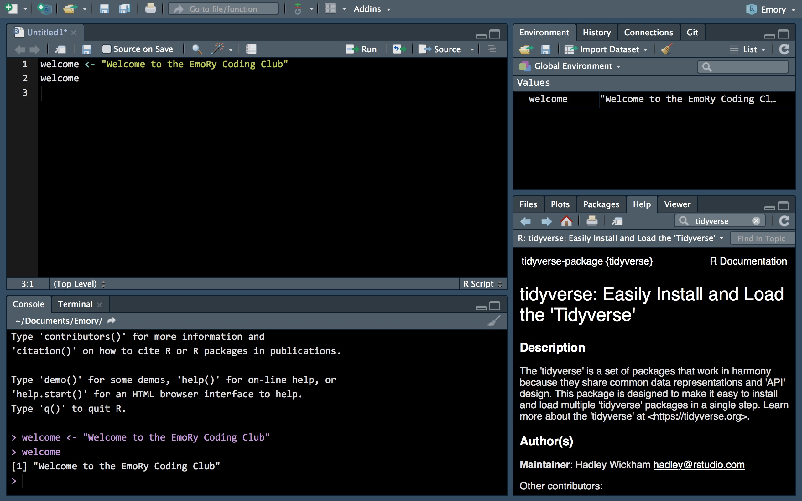
</div>
<!-- ----------------------- image --------------------------- -->
\  

A more complete example of what you can acheive with the interface.  
\  

<!-- ----------------------- image --------------------------- -->
<div align="center">
  
</div>
<!-- ----------------------- image --------------------------- -->
\  

# Loading packages, e.g. `tidyverse`  

How to load packages in `R`.  


```r
install.packages("tidyverse")  # install package
library(tidyverse)  # load the package library
require(tidyverse)  # same as library    

# We are typing in an R Script. Things with # in front make them comments and notes to ourselves
# Command Return to execute the line/ 'run the code'
```
\  

# Using built-in `R` data: the `mpg` dataset   
[Section 3.2.1](https://r4ds.had.co.nz/data-visualisation.html#the-mpg-data-frame)  

We'll use a built-in tidyverse dataset called `mpg` with data about cars and gas-mileage.


```r
mpg
# run help page with '?'
`?`(mpg)
```

* This is a tibble (data frame) that we've "printed" out. It's like R's version of an excel spreadsheet, but much better. 
* A tibble will show us the first 10 rows, rows containing the data, column names, and the class of data within each column, such as numeric, integer, or character.    

## Summarising data        

```r
str(mpg)  # structure of data
glimpse(mpg)  # preview of data 
summary(mpg)  # basic summary stats  
table(mpg$manufacturer)  # counts of each column
head(mpg)  # visualise first 6 rows of data
tail(mpg, 10)  # visualise last 10 (or N) rows of data 
names(mpg)  # get column names
class(mpg)  # class of data frame
class(mpg$manufacturer)  # class of data column
mpg$displ  # print a column
mpg$hwy  # print a column
```
\    

# Creating a plot with `ggplot`  
[Section 3.2.2](https://r4ds.had.co.nz/data-visualisation.html#creating-a-ggplot)     

* `ggplot()` Creates a coordinate system for us--basically an empty graph.  
* `geom_point()` Adds a "layer", e.g. geom_point (but there are many for different kinds of graphs).  

Plot two of the data columns  

```r
ggplot(data = mpg) + geom_point(mapping = aes(x = displ, y = hwy))
```

<!-- -->
\  

Changing the data column inputs for the **x** and **y** axis of the plot  

```r
ggplot(data = mpg) + geom_point(mapping = aes(x = class, y = drv))
```

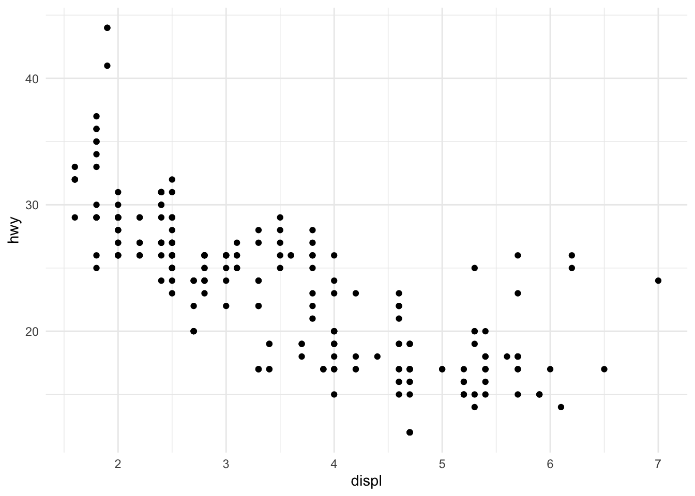<!-- -->
\  

Assign data to variables to create dynamic inputs  

```r
my_data <- mpg  # create own variable using a name of your choice  

ggplot(data = my_data) + geom_point(mapping = aes(x = displ, y = hwy))
```

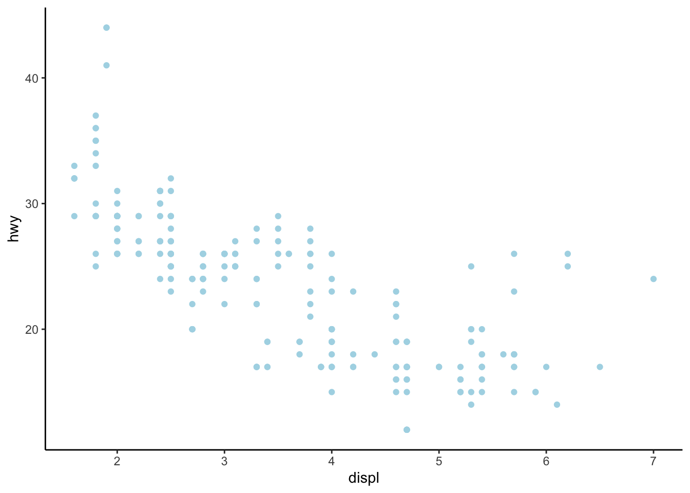<!-- -->
\  

## Themes  

Change plot style. Link for more [ggplot themes](https://www.datanovia.com/en/blog/ggplot-themes-gallery/).        

```r
require(ggthemes)

# classic theme
ggplot(data = my_data) + geom_point(mapping = aes(x = displ, y = hwy)) + theme_minimal()
```

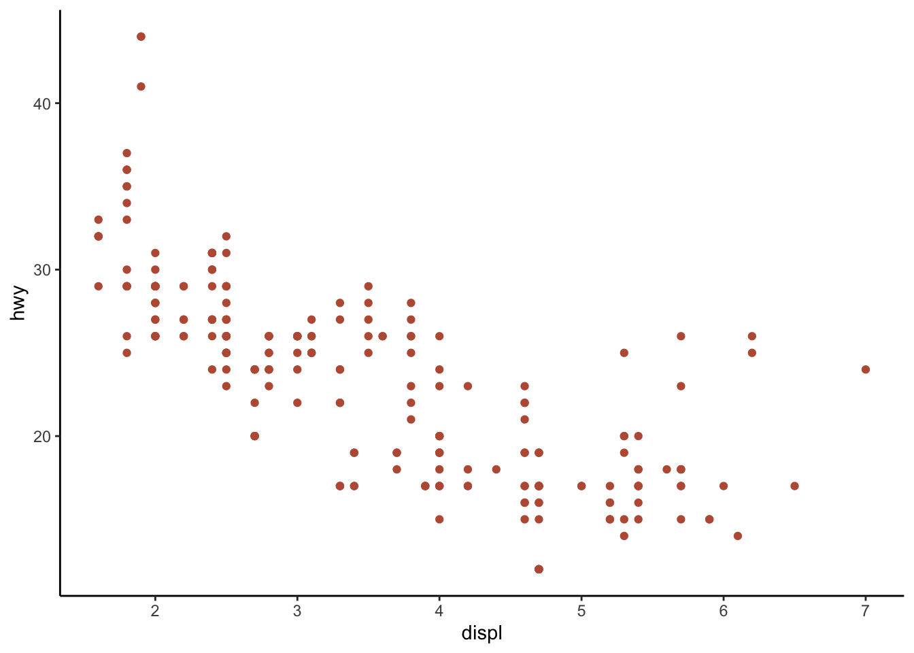<!-- -->

```r
# minimal theme
ggplot(data = my_data) + geom_point(mapping = aes(x = displ, y = hwy)) + theme_tufte()
```

<!-- -->

```r
# assign theme to variable
my_theme <- theme_classic()
ggplot(data = my_data) + geom_point(mapping = aes(x = displ, y = hwy)) + my_theme  # apply your chosen theme  
```

<!-- -->
\  

# Aesthetic mapping  
[Section 3.3](https://r4ds.had.co.nz/data-visualisation.html#aesthetic-mappings)  

`color`. Change the color of the data points.
`size`. Change the size of the data points.  
`alpha`. Change the transparency of the data points.   

## Color

Color by color name. 

```r
ggplot(data = my_data) + geom_point(mapping = aes(x = displ, y = hwy), color = "light blue") + my_theme
```

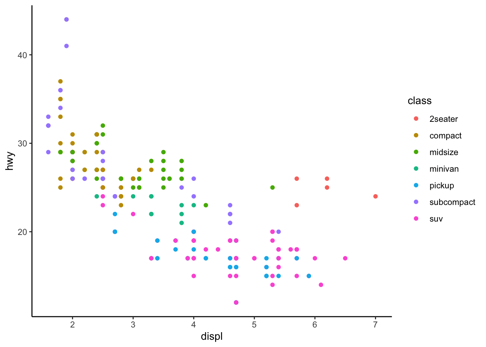<!-- -->
\   

Color by a [hex code](https://htmlcolorcodes.com/color-picker/) in quotes.  

```r
ggplot(data = my_data) + geom_point(mapping = aes(x = displ, y = hwy), color = "#BB5C42") + my_theme
```

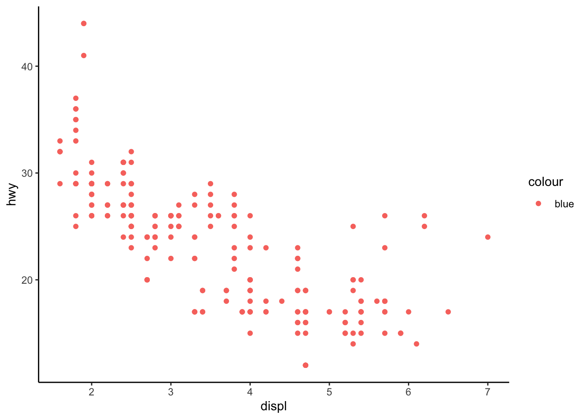<!-- -->
\  

Color by data column  

```r
ggplot(data = my_data) + geom_point(mapping = aes(x = displ, y = hwy, color = class)) + my_theme
```

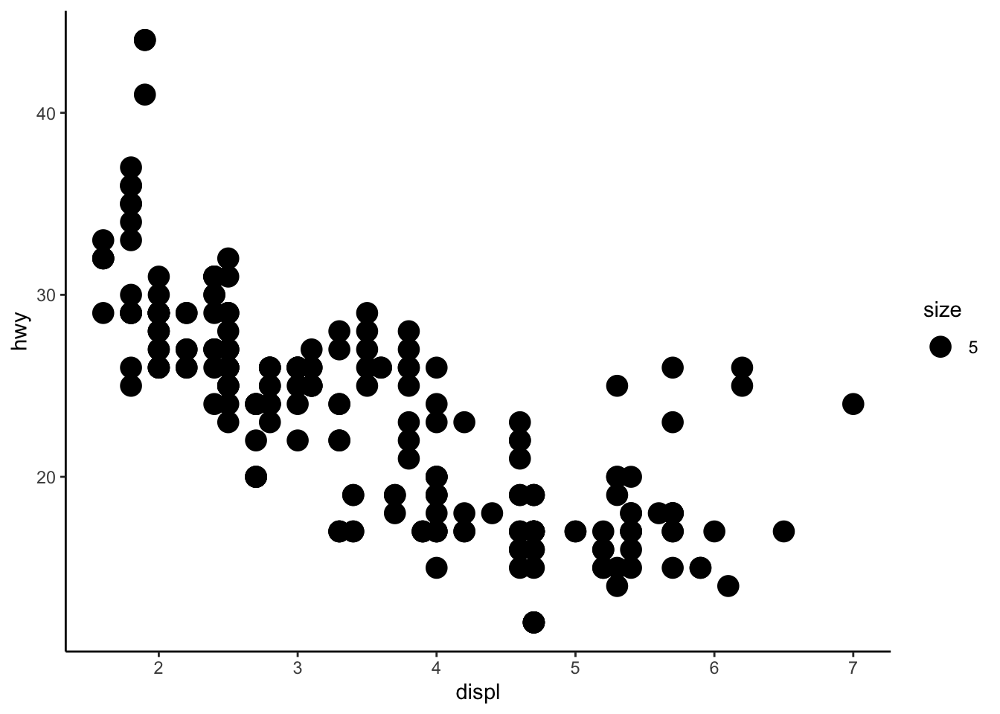<!-- -->
\  

Inside versus outside the `aes`  

```r
ggplot(data = my_data) + geom_point(mapping = aes(x = displ, y = hwy, color = "blue")) + my_theme
```

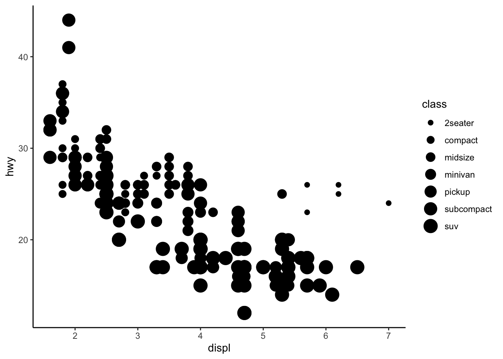<!-- -->
\  

## Size 

Size by integer  

```r
ggplot(data = my_data) + geom_point(mapping = aes(x = displ, y = hwy, size = 5)) + my_theme
```

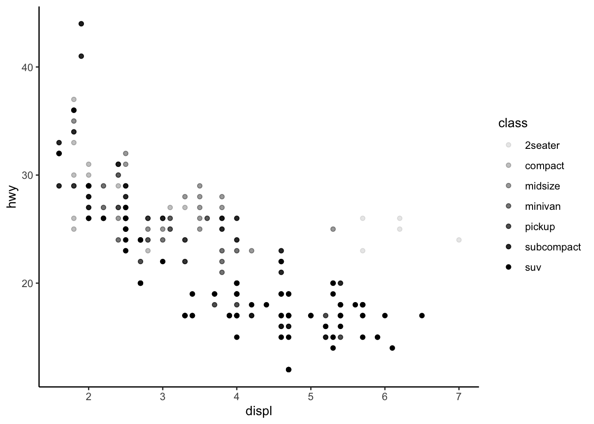<!-- -->
\  

Size by data column      

```r
ggplot(data = my_data) + geom_point(mapping = aes(x = displ, y = hwy, size = class)) + my_theme
```

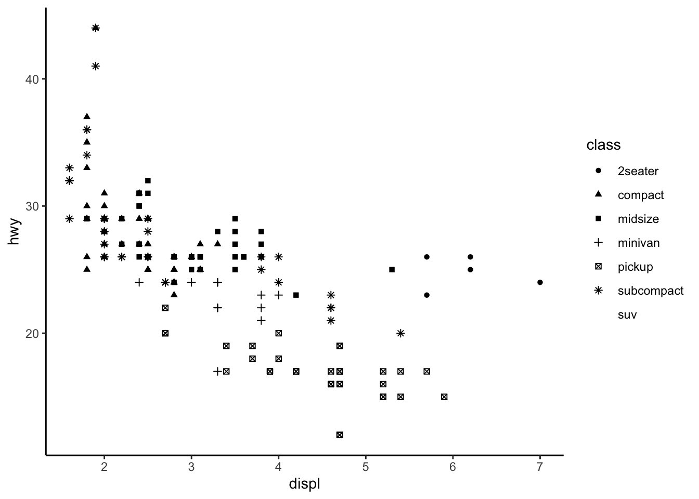<!-- -->
\  

We get a warning, but this is okay.  
\  

## Transparency 

```r
# map classe column to different transparencies
ggplot(data = my_data) + geom_point(mapping = aes(x = displ, y = hwy, alpha = class)) + my_theme
```

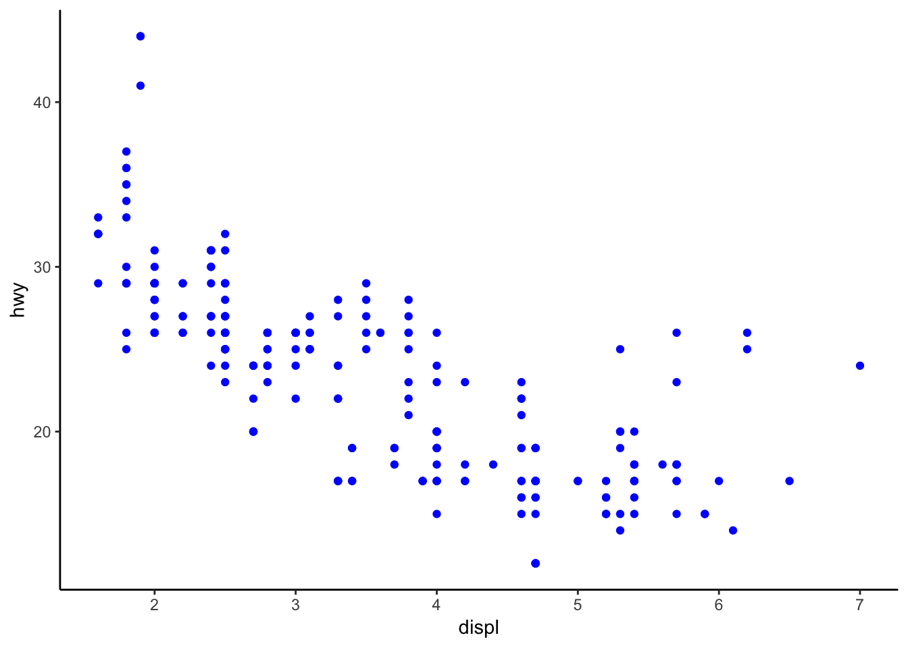<!-- -->
\  

## Shape  

```r
ggplot(data = my_data) + geom_point(mapping = aes(x = displ, y = hwy, shape = class)) + my_theme
```

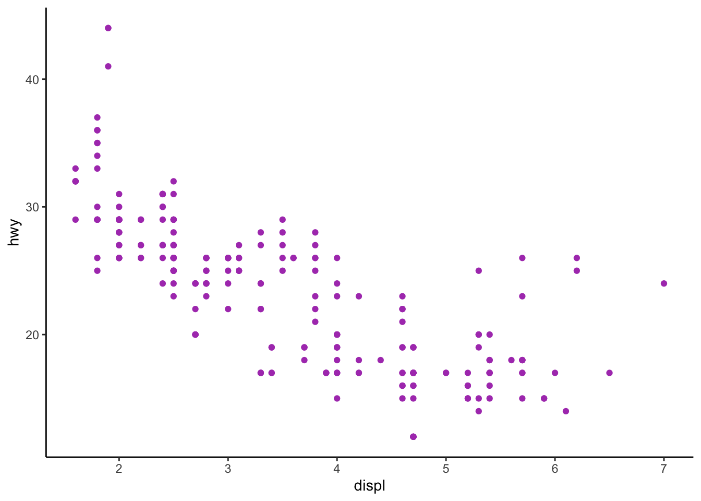<!-- -->
\  

Any warnings? Yes, because shape maxes out at six levels.
\  

## Manually changing aesthetic properties
  
But we can *set* the aesthetic properties manually, instead of having ggplot do the scaling automatically. For example, we can make our ggplot points all blue like this. This time, putting color OUTSIDE the `aes` argument.


```r
ggplot(data = my_data) + geom_point(mapping = aes(x = displ, y = hwy), color = "blue") + my_theme
```

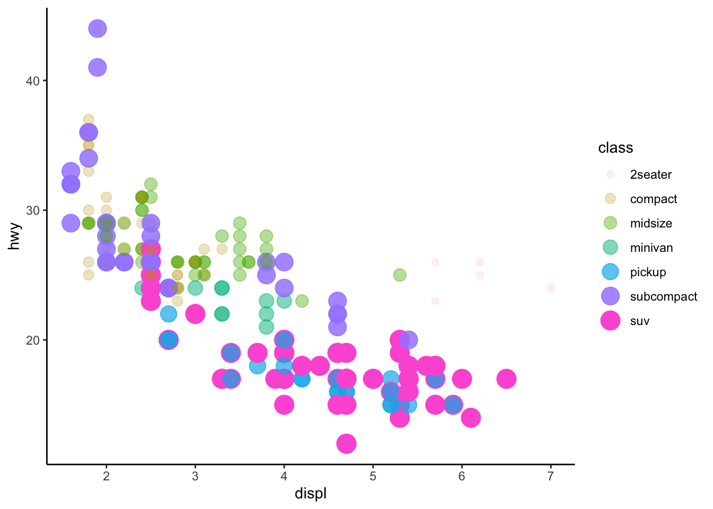<!-- -->
\  

Using color both inside and outside the aes  

```r
ggplot(data = my_data) + geom_point(mapping = aes(x = displ, y = hwy, color = class), color = "#AE42BB") + 
    my_theme
```

<!-- -->
\  

**The inner one is overridden.**     
\  

Putting it all together as a snapshot of what's possible  

```r
ggplot(data = my_data) + geom_point(mapping = aes(x = displ, y = hwy, color = class, size = class, alpha = class)) + 
    my_theme
```

<!-- -->

## Aesthetics you can manually set  

  * The name of a color as a character string.
  * The size of a point in mm.
  * The shape of a point as a number, as shown in Figure 3.1. 
  
  <!-- ----------------------- image --------------------------- -->
<div align="center">
  
</div>
<!-- ----------------------- image --------------------------- -->
\  
  
`R` has 25 built in shapes that are identified by numbers. There are some seeming duplicates: for example, 0, 15, and 22 are all squares. The difference comes from the interaction of the `colour` and `fill` aesthetics. The hollow shapes (0--14) have a border determined by `colour`; the solid shapes (15--18) are filled with `colour`; the filled shapes (21--24) have a border of `colour` and are filled with `fill`.  

\newpage      

# Further plotting examples    
[Section 3.3.1](https://r4ds.had.co.nz/data-visualisation.html#exercises-1)  

The online reference contains further examples of how to visualise your data.    

# Reading in outside data: NYC AirBnB data  


```r
library(tidyverse)  # includes package 'readr'
# All Airbnb data (106 cols)
url <- "http://data.insideairbnb.com/united-states/ny/new-york-city/2019-06-02/data/listings.csv.gz"

nyc_full <- read_csv(url)  # reads in data
glimpse(nyc_full)
```
\  

Using a smaller dataset 

```r
# smaller csv file (16 cols)
url <- "http://data.insideairbnb.com/united-states/ny/new-york-city/2019-06-02/visualisations/listings.csv"

nyc <- read_csv(url)
nyc <- nyc[nyc$id < 1e+06, ]  # get smaller subet of data
length(nyc$id)  # print length of 'id' column
```

```
[1] 2177
```
\    

# Plotting AirBnB data with ggplot  

Using the above plotting functions to visualise the AirBnB data  


```r
# plot neighborhood_group vs price
ggplot(data = nyc) + geom_point(mapping = aes(x = neighbourhood_group, y = price, color = neighbourhood_group), 
    shape = 21, stroke = 1) + my_theme
```

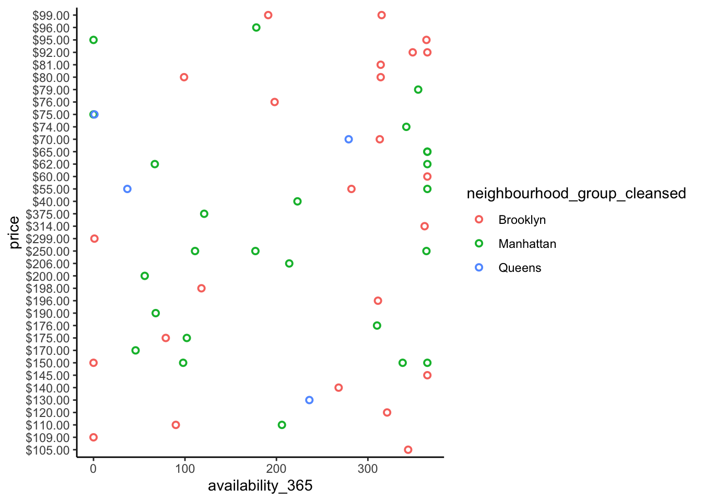<!-- -->


```r
# plot minimum_nights vs price
ggplot(data = nyc) + geom_point(mapping = aes(x = minimum_nights, y = price, color = neighbourhood_group), 
    shape = 20, size = 3, stroke = 1) + my_theme
```

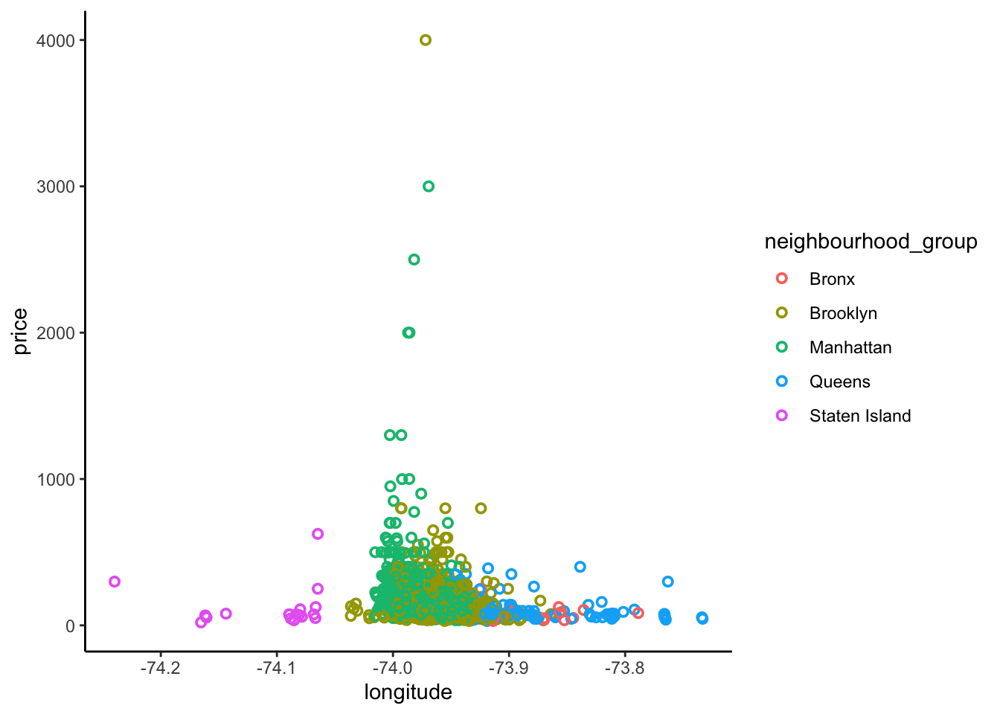<!-- -->


```r
# availability_365 vs price
ggplot(data = nyc) + geom_point(mapping = aes(x = availability_365, y = price, color = neighbourhood_group), 
    shape = 21, stroke = 1) + my_theme
```

<!-- -->
    

```r
# plot longitude vs price
ggplot(data = nyc) + geom_point(mapping = aes(x = longitude, y = price, color = neighbourhood_group), 
    shape = 21, stroke = 1) + my_theme
```

<!-- -->


Try your own plot using the other variables in the dataset    

```r
# plot neighborhood_group vs price
names(airbnb)
glimpse(airbnb)

my_data <- NULL
x <- NULL
y <- NULL
color <- NULL
shape <- NULL
stroke <- NULL
```


<!-- end body -->
<!-- ____________________________________________________________________________ -->
<!-- ____________________________________________________________________________ -->
<!-- ____________________________________________________________________________ -->

   
