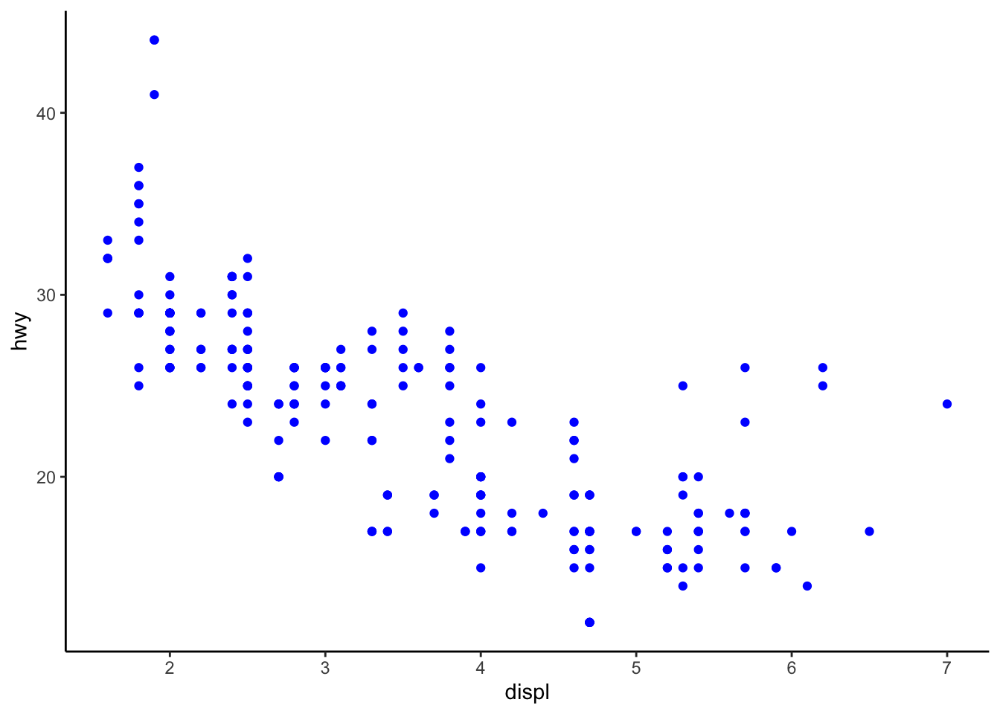

\  

# Agenda

We'll use the content from Chapter 3 of the R for Data Science book. 

1. Loading the tidyverse
2. Preview a built-in dataset
3. Using ggplot with the built-in data set (to make scatterplots)
4. Modifying plot aesthetics
5. Reading in outside data
6. Plotting outside data with ggplot

\  

# Loading the tidyverse

We'll load the tidyverse-- you can think of this as a big conglomeration of packages that give us useful functionality (kind of like downloading apps on our phone, for example).

\  


```r
library(tidyverse)
# We are typing in an R Script. Things with # in front make them comments and notes to ourselves
# Command Return to execute the line/ "run the code"
```

\  

# 3.2.1 The `mpg` data frame

We'll use a built-in tidyverse dataset called `mpg` with data about cars and gas-mileage.


```r
mpg
?mpg
```

* This is a tibble (data frame) that we've "printed" out. It's like R's version of an excel spreadsheet, but much better. 
* A tibble will show us first 10 rows.

Among the variables in `mpg` are:

* `displ`, a car’s engine size, in litres.
* `hwy`, a car’s fuel efficiency on the highway, in miles per gallon (mpg). 

\  

# 3.2.2 Creating a ggplot

Run and plot this code first: 


```r
ggplot(data = mpg) + 
  geom_point(mapping = aes(x=displ, y = hwy))
```

This is a plot of the two variables highlighted above. 

Now here's what's going on: 

* ggplot() is creating a coordinate system for us--basically an empty graph (This is Exercise #1 later).
* Now add a "layers", e.g. geom_point (but there are many for different kinds of graphs). Today, we're sticking to scatterplots and geom_point.
* This always has a mapping argument. Mapping and `aes` will always go together. The `x` and `y` of `aes`, is where we specify what variables go on which axis.

\  

# 3.2.3 A graphing template

We can keep re-using our ggplot code as a template-- to create new plots. The next sections will be about how to modify the mappings and aesthetics to visualize different parts of this dataset.

\  

# 3.2.4 Exercises, 10 minutes (?)

1. Run `ggplot(data = mpg)`. What do you see?  


```r
ggplot(data = mpg)
```

\  

2. How many rows are in `mpg`? How many columns?


```r
mpg #234 rows, 11 columns, which we know from the tibble output
glimpse(mpg) # Can also do it this way
str(mpg) # or the base r way
```

\  

3. What does the `drv `variable describe? Read the help for ?mpg to find out.

```r
?mpg 
```

If we print `mpg` and find drv column, it's a bunch of weird values. What do they mean? Check the help documentation to find out. `?` works because this data set is built-in.

\  

4. Make a scatterplot of `hwy` vs `cyl`.


```r
ggplot(data = mpg) + 
  geom_point(mapping = aes(x=hwy, y=cyl))
```
\  

5. What happens if you make a scatterplot of class vs drv? Why is the plot not useful?


```r
ggplot(data = mpg) + 
  geom_point(mapping = aes(x=class, y=drv))
```

\  

# 3.3 Aesthetic mappings


By adding a 3rd variable to a 2D scatterplot (aka the size, shape, or color of our points). We can   change the "Level" of a point's size, shape, or color. ggplot then chooses an appropriate scale to visualize each of these. For example:


```r
ggplot(data = mpg) + 
  geom_point(mapping = aes(x = displ, y = hwy, color = class))
```
\  

1. Map class to **size** aesthetic


```r
ggplot(data = mpg) + 
  geom_point(mapping = aes(x = displ, y = hwy, size = class))
```

We get a warning, but this is okay.
\

2. Now try using **alpha** as the aesthetic:


```r
  ggplot(data = mpg) + 
  geom_point(mapping = aes(x = displ, y = hwy, alpha = class)) # maps classes to different transparencies
```

\

3. What happens when you map class to the **shape** aesthetic?


```r
  ggplot(data = mpg) + 
    geom_point(mapping = aes(x = displ, y = hwy, shape = class))
```

Any warnings? Yes -- because shape maxes out at six levels.

\
## Manually changing aesthetic properties
  
But we can *set* the aesthetic properties manually, instead of having ggplot do the scaling automatically. For example, we can make our ggplot points all blue like this. This time, putting color OUTSIDE the `aes` argument.


```r
  ggplot(data = mpg) + 
    geom_point(mapping = aes(x = displ, y = hwy), color = "blue")
```
\

1. Try specifying the color with a [hex code] (https://htmlcolorcodes.com/color-picker/) in quotes. 


```r
  ggplot(data = mpg) + 
    geom_point(mapping = aes(x = displ, y = hwy), color = "#FFFFFF")
```
\

2. What happens if you specify color in two places (i.e. inside AND outside of the `aes` argument)?

 
 ```r
  ggplot(data = mpg) + 
  geom_point(mapping = aes(x = displ, y = hwy, color = class), color = "#FFFFFF")
 ```
\ 
The inner one is overridden. 

\

3. Extra question: Can you try to generate a plot that looks like this?


```
## Warning: Using size for a discrete variable is not advised.
```

```
## Warning: Using alpha for a discrete variable is not advised.
```

<!-- -->

\

## Aesthetics you can manually set: 
  * The name of a color as a character string.
  * The size of a point in mm.
  * The shape of a point as a number, as shown in Figure 3.1. 
  
  <center>{width=400px}</center>
  
R has 25 built in shapes that are identified by numbers. There are some seeming duplicates: for example, 0, 15, and 22 are all squares. The difference comes from the interaction of the `colour` and `fill` aesthetics. The hollow shapes (0--14) have a border determined by `colour`; the solid shapes (15--18) are filled with `colour`; the filled shapes (21--24) have a border of `colour` and are filled with `fill`.
  
 
Here's an example using a specific shape and size for all points.


```r
  ggplot(data = mpg) + 
    geom_point(mapping = aes(x = displ, y = hwy, size = cyl), shape = 21, size = 6)
```
\
  
# 3.3.1 Exercises

Try these on your own. 15 min?
\

1. What’s gone wrong with this code? Why are the points not blue?


\  

2.  Which variables in mpg are categorical? Which variables are continuous? (Hint: type ?mpg to read the documentation for the dataset). How can you see this information when you run mpg?


\

3.  Map a continuous variable to color, size, and shape. How do these aesthetics behave differently for categorical vs. continuous variables?


\    
    
4. What happens if you map the same variable to multiple aesthetics?


\

5. What does the stroke aesthetic do? What shapes does it work with? (Hint: use ?geom_point)


\

6. What happens if you map an aesthetic to something other than a variable name, like aes(colour = displ < 5)? Note, you’ll also need to specify x and y.
  

  
\

## 3.4 Common problems

Make sure that you: 
  * Haven't put `+` on the wrong line
  * Use ( ) and "" in pairs
  * Make use of `?`
    

\

# Using wild-caught data

The airbnb data set is not a built in data set, so no we can't use ?dataset help.

\

# Read in data


```r
library(tidyverse) # includes package "readr"

# All Airbnb data (106 cols)
url <- "http://data.insideairbnb.com/united-states/ny/new-york-city/2019-06-02/data/listings.csv.gz"

df_full <- read_csv(url) # reads in data
df <- df_full[df_full$id<1000000,] # subsets ~2k of the ~48k entries based on (arbitrary?) id 
df # prints as a tibble
```


\

## Taking a quick look at the larger data set
* Use glimpse(df) to see a list of all the columns
* Real data has messy entries, e.g. "Williamsburg, Brooklyn" and "Williamsburg bk" 

\

Let's stick with a smaller data set

```r
# smaller csv file (16 cols)
url <- "http://data.insideairbnb.com/united-states/ny/new-york-city/2019-06-02/visualisations/listings.csv"

df_full <-  read_csv(url)
```

```
## Parsed with column specification:
## cols(
##   id = col_double(),
##   name = col_character(),
##   host_id = col_double(),
##   host_name = col_character(),
##   neighbourhood_group = col_character(),
##   neighbourhood = col_character(),
##   latitude = col_double(),
##   longitude = col_double(),
##   room_type = col_character(),
##   price = col_double(),
##   minimum_nights = col_double(),
##   number_of_reviews = col_double(),
##   last_review = col_date(format = ""),
##   reviews_per_month = col_double(),
##   calculated_host_listings_count = col_double(),
##   availability_365 = col_double()
## )
```

```r
df <- df_full[df_full$id<1000000,]
df
```

```
## # A tibble: 2,177 x 16
##       id name  host_id host_name neighbourhood_g… neighbourhood latitude
##    <dbl> <chr>   <dbl> <chr>     <chr>            <chr>            <dbl>
##  1  2539 Clea…    2787 John      Brooklyn         Kensington        40.6
##  2  2595 Skyl…    2845 Jennifer  Manhattan        Midtown           40.8
##  3  3647 THE …    4632 Elisabeth Manhattan        Harlem            40.8
##  4  3831 Cozy…    4869 LisaRoxa… Brooklyn         Clinton Hill      40.7
##  5  4989 Grea…    7118 New-York… Manhattan        Hell's Kitch…     40.8
##  6  5022 Enti…    7192 Laura     Manhattan        East Harlem       40.8
##  7  5099 Larg…    7322 Chris     Manhattan        Murray Hill       40.7
##  8  5121 Blis…    7356 Garon     Brooklyn         Bedford-Stuy…     40.7
##  9  5178 Larg…    8967 Shunichi  Manhattan        Hell's Kitch…     40.8
## 10  5203 Cozy…    7490 MaryEllen Manhattan        Upper West S…     40.8
## # … with 2,167 more rows, and 9 more variables: longitude <dbl>,
## #   room_type <chr>, price <dbl>, minimum_nights <dbl>,
## #   number_of_reviews <dbl>, last_review <date>, reviews_per_month <dbl>,
## #   calculated_host_listings_count <dbl>, availability_365 <dbl>
```

```r
glimpse(df)
```

```
## Observations: 2,177
## Variables: 16
## $ id                             <dbl> 2539, 2595, 3647, 3831, 4989, 502…
## $ name                           <chr> "Clean & quiet apt home by the pa…
## $ host_id                        <dbl> 2787, 2845, 4632, 4869, 7118, 719…
## $ host_name                      <chr> "John", "Jennifer", "Elisabeth", …
## $ neighbourhood_group            <chr> "Brooklyn", "Manhattan", "Manhatt…
## $ neighbourhood                  <chr> "Kensington", "Midtown", "Harlem"…
## $ latitude                       <dbl> 40.64749, 40.75362, 40.80902, 40.…
## $ longitude                      <dbl> -73.97237, -73.98377, -73.94190, …
## $ room_type                      <chr> "Private room", "Entire home/apt"…
## $ price                          <dbl> 149, 225, 150, 89, 105, 80, 200, …
## $ minimum_nights                 <dbl> 1, 1, 3, 1, 4, 10, 3, 45, 2, 2, 1…
## $ number_of_reviews              <dbl> 9, 44, 0, 258, 27, 9, 71, 49, 424…
## $ last_review                    <date> 2018-10-19, 2019-05-07, NA, 2019…
## $ reviews_per_month              <dbl> 0.21, 0.38, NA, 4.53, 0.24, 0.10,…
## $ calculated_host_listings_count <dbl> 6, 2, 1, 1, 1, 1, 1, 1, 1, 1, 4, …
## $ availability_365               <dbl> 365, 331, 365, 182, 83, 0, 92, 0,…
```

\

# Use `ggplot()`

* We'll do 1 together.
* Create new scatter plots with the data on your own
    * Explore at least 3 different variable relationships
    * Do 1 version of a presentable ggplot
    * Take the same ggplot and make change the aesthetics to make it an ugly ggplot
    * **Bonus points**: copy and paste the following code into one of your existing ggplots as an additional layer to make a very ugly ggplot! Run the plot to see what this produces. Then modify some of the arguments to make the plot look more acceptable!
      
```   
    +
  theme(
    
    plot.background = element_rect(fill = "lightyellow"),
    plot.title = element_text(size = 30, hjust = 0.25),
    plot.subtitle = element_text(size = 20, hjust = 0.75, color = "mediumvioletred", family = "serif"),
    plot.caption = element_text(size = 10, face = "italic", angle = 25),
    
    panel.background = element_rect(fill = 'lightblue', colour = 'darkred', size = 4),
    panel.border = element_rect(fill = NA, color = "green", size = 2),
    panel.grid.major.x = element_line(color = "purple", linetype = 2),
    panel.grid.minor.x = element_line(color = "orange", linetype = 3),
    panel.grid.minor.y = element_blank(),
    
    axis.title.x = element_text(face = "bold.italic", color = "blue"),
    axis.title.y = element_text(family = "mono", face = "bold", size = 20, hjust = 0.25),
    axis.text = element_text(face = "italic", size = 15),
    axis.text.x.bottom = element_text(angle = 180), # note that axis.text options from above are inherited
    
    strip.background = element_rect(fill = "magenta"),
    strip.text.y = element_text(color = "white"),
    strip.placement = "outside",
    
    legend.background = element_rect(fill = "orangered4"), # generally will want to match w plot background
    legend.key = element_rect(fill = "orange"),
    legend.direction = "horizontal",
    legend.position = "bottom",
    legend.justification = "left",
    legend.title = element_text(family = "serif", color = "white"),
    legend.text = element_text(family = "mono", face = "italic", color = "limegreen")
    
  ) +
  labs(title = "test title",
       subtitle = "test subtitle",
       x = "my x axis",
       y = "my y axis",
       caption = "this is a caption",
       col = "Renamed Legend") 
```        
* Ugly ggplot code courtesy of [Emily Riederer](https://gist.github.com/emilyriederer/2bf4f67d7e198f8359b61706c82e42ee)
\


```r
  # plot neighborhood_group vs price
    
    ggplot(data = df) + 
      geom_point(mapping = aes(x = neighbourhood_group, y = price, color = neighbourhood_group), shape = 21, stroke = 1)
```

<!-- -->
\


\


 \
 

   
