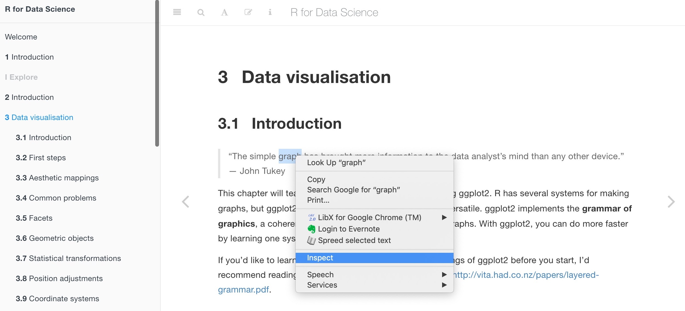

---
params:
  lesson: "Lesson 10"
  title: "Scraping webpage data and text"  
  bookchapter_name: "Webscrape text and data"    
  bookchapter_section: "https://rvest.tidyverse.org/"    
  functions: "`read_html`,`html_node`,`html_nodes`, `html_attr`, `html_text`, `html_table`"
  packages: "`rvest`,`xml2`,`magick`,`magrittr`"      
# end inputs ---------------------------------------------------------------
header-includes: \usepackage{float}
always_allow_html: yes
output:
  html_document:
    code_folding: show
---
  
```{r, setup, echo = FALSE, cache = FALSE, include = FALSE}
options(width=100)
knitr::opts_chunk$set(
  eval = T, # run all code
  echo = TRUE, # show code chunks in output 
  tidy = TRUE, # make output as tidy
  message = FALSE,  # mask all messages
  warning = FALSE, # mask all warnings 
  comment = "",
  tidy.opts=list(width.cutoff=100), # set width of code chunks in output
  size="small" # set code chunk size
)
```
\  

<!-- install packages -->
```{r, load packages, eval=T, include=T, cache=F, message=F, warning=F, results='hide',echo=F}
packages <- c("ggplot2","ggthemes","dplyr","tidyverse","zoo","RColorBrewer","viridis","plyr")   
if (require(packages)) {
  install.packages(packages,dependencies = T)
  require(packages)
  # load tvthemes
  devtools::install_github("Ryo-N7/tvthemes")
}
lapply(packages,library,character.only=T)  
```

<!-- ____________________________________________________________________________ -->
  <!-- ____________________________________________________________________________ -->
  <!-- ____________________________________________________________________________ -->
  <!-- start body -->
  
# `r paste0(params$lesson,": ",params$title)`    
  \  

Functions for `r params$lesson`  
`r params$functions`    
\    

Packages for `r params$lesson`          
`r params$packages`        
\    

# Agenda 

<!-- ----------------------- image --------------------------- -->
<div align="center">
  
</div>


Webscrape data from `R` using `rvest` and `xml2` packages.  

[`r params$bookchapter_name`](`r params$bookchapter_section`).      
\


# Reading webpage data (HTML)  
Rather than pulling the entire webpage text, specify HTML elements (nodes), such as headings, tables, images to scrape. 

Use `html_node` to get only the first HTML node and `html_nodes` to pull all elements. This is useful when you want to get just the first element you're after or all text or data within a table, for example.    
```{r}
require(rvest)
require(xml2)

url <- "https://r4ds.had.co.nz/data-visualisation.html" # url to scrape 

url %>% read_html # scrape HTML text and data

# scraping the first node only for third order headings ("h3")
url %>% read_html %>% html_node("h3") # get only first section heading

# scraping all nodes in the webpage   
url %>% read_html %>% html_nodes("h3") # get section headings
url %>% read_html %>% html_nodes("img") # get just images


```

Write a simple function to pull the HTML node you're interested in  
```{r}
node <- function(n){
  url %>% read_html %>% html_nodes(n)  # n = user defined node 
}
```

Pull specific text, such as headings using HTML elements, i.e. `<h1>`, ``, etc  
```{r}
node("h1") # get first order headings

# now pull just the text without the HTML elements  
node("h2") %>% html_text(trim=T) 
node("strong") %>% html_text(trim=T) # get just bold text 

```


Find and pull all unique `R` functions from the webpage and view the first 10 results 
```{r}
node("code") %>% html_text(trim = T) %>% unique %>% head(10)
```

\  

#### If you're unsure what node to call, right click on the piece of data/text you want from the webpage and click "Inspect". Here, you can identify the HTML element you need.      

E.g. I want just the quotes from the page, but don't know what type of node they belong to. After inspecting the element, we can see it's called a 'blockquote'.    

<!-- ----------------------- image --------------------------- -->
<div align="center">
  
</div>
<!-- ----------------------- image --------------------------- -->
\    

```{r}
node("blockquote") %>% html_text(trim = T) 
```


Scrape table data 
```{r}
url <- "https://www.imdb.com/title/tt0094625/?ref_=fn_al_tt_1"
url %>% read_html %>% html_table(trim = T)  # get just tables
```

## Finding and scraping specific attributes within a webpage  

Let's say you wanted to scrape all the urls within a webpage, but ignore the urls contained within some parts of the page, e.g. the sidebar or footer.   

We can use `html_attr()` to identify nested elements within HTML elements. 

This code scrapes the urls from the below webpage, but inclues all possible urls, which is not what we want.    
```{r}
url <- "https://r4ds.had.co.nz/index.html"
node("a") %>% head(20) # return first 20 results
```

Specifying the main body of the webpage ("section") solves this, but we still want just the urls. Using `html_attr()` gives us just the url portion of the HTML link element (`<a>`)   
```{r}
node("section") %>% html_nodes("a") %>% html_attr("href") %>% head(20) # return first 20 results
```

If you wanted just the text associated with the links and not the link themselves, just pull the text instead of using `html_attr()`  
```{r}
node("section") %>% html_nodes("a") %>% html_text() %>% head(20) # return first 20 results
```

To pull a value/term from a webscraped vector, you can use `extract2()` from the `magrittr` package to specify the position in the vector 
```{r}
require(magrittr)
node("section") %>% 
  html_nodes("a") %>%
  extract2(3) %>% # get the 3rd scraped term
  html_text()  
```

Alternatively, you can index the term    
```{r}
node("section") %>% 
  html_nodes("a") %>% 
  .[[3]] %>% # get the 3rd scraped term
  html_text() 
```

## Plotting images directly from webpages  

Use `image_read()` from the `magick` package to plot images directly after scraping from a webpage     

```{r}
require(magick)
node("img") %>% html_attr("src") %>% image_read()
```


## Challenge  

Find and scrape in the image from the below url and plot it, all without leaving `R` or saving the img to your drive.     

```{r}
url <- "https://www.imdb.com/title/tt0094625/?ref_=fn_al_tt_1"  
```


```{r,echo=F,eval=T,warning=F}
require(magick)
require(magrittr)
node("img") %>% html_attr("src") %>% extract2(3) %>% image_read()
```
