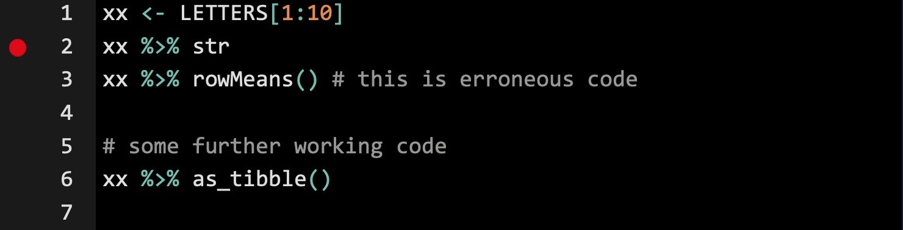
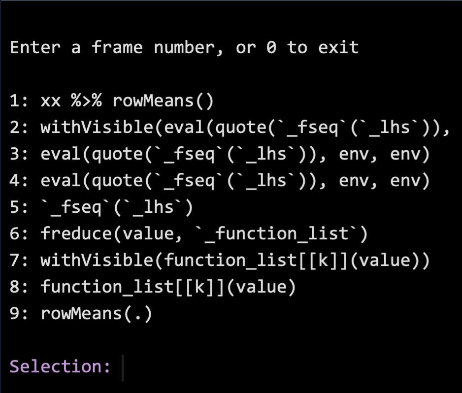
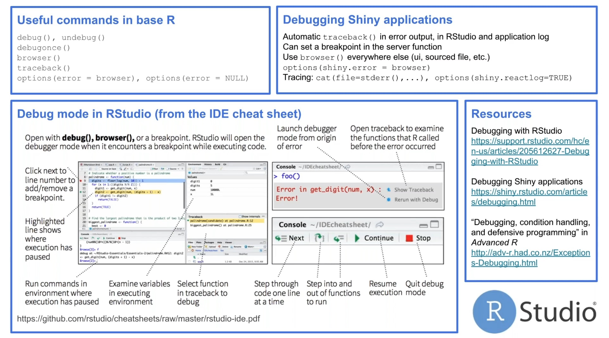

---
params:
  lesson: "Lesson 11"
  title: "Debugging and troubleshooting in `R`"    
  bookchapter_name: "Debugging in `R`"    
  bookchapter_section: "https://rvest.tidyverse.org/"    
  functions: "`debug()`,`traceback()`,`browser()`, `options()`, `test_that()`, `qq_show()`"
  packages: "`reprex`, `rlang`, `testthat`"      
# end inputs ---------------------------------------------------------------
header-includes: \usepackage{float}
always_allow_html: yes
output:
  html_document:
    code_folding: show
---
  
```{r, setup, echo = FALSE, cache = FALSE, include = FALSE}
options(width=100)
knitr::opts_chunk$set(
  eval = F, # run all code
  echo = TRUE, # show code chunks in output 
  tidy = TRUE, # make output as tidy
  message = FALSE,  # mask all messages
  warning = FALSE, # mask all warnings 
  comment = "",
  tidy.opts=list(width.cutoff=100), # set width of code chunks in output
  size="small" # set code chunk size
)
```
\  

<!-- install packages -->
```{r, load packages, eval=T, include=T, cache=F, message=F, warning=F, results='hide',echo=F}
packages <- c("ggplot2","ggthemes","dplyr","reprex","rlang")   
if (require(packages)) {
  install.packages(packages,dependencies = T)
  require(packages)
}
lapply(packages,library,character.only=T)  
```

<!-- ____________________________________________________________________________ -->
  <!-- ____________________________________________________________________________ -->
  <!-- ____________________________________________________________________________ -->
  <!-- start body -->
  
# `r paste0(params$lesson,": ",params$title)`    
  \  

Functions for `r params$lesson`  
`r params$functions`    
\    

Packages for `r params$lesson`          
`r params$packages`        
\    

# Agenda 

<!-- ----------------------- image --------------------------- -->
<div align="center">
  
</div>


Debugging with purpose in `R`    

[`r params$bookchapter_name`](`r params$bookchapter_section`).      
\  

## Troubleshooting terminology    


error  
debug  
breakpoint  
callstack   
traceback  
browser  

### Restart your `R` workspace  
The blanket approach to debugging. This resets your installed packages to the version you initially loaded on your computer and into the memory in your new `R` session.  


## Common arenas that breed errors and issues    

### Working with many packages across multiple `R` sessions     
* Restart `R` to reload the current package version into the `R` session memory   
* Change your `R` preferences so that your current workspace doesn't translate stored objects to any future workspaces 
- Set "Save workspace to .Rdata on exit" to 'Never'   
- Uncheck "Restore .Rdata into workspace on startup"  

### Finding errors in collaborators' code  
* Create a minimal reproducible example     
Advantages of creating minimal reproducible examples  
- Removes noise from your problem code  
- Creates a neater template for outside help e.g. StackOverflow forums - Helps you diagnose and solve your own problem  
- Feedsback to deeper understanding of root issues to simplify future troubleshooting  


## Debug menu 

Changing the way errors are diagnosed using the Debug dropdown menu options  

Debug > On Error > Error inspector   
Debug > On Error > Message only 

## `debug()` function and using breakpoints    

1. Insert breakpoints in RStudio IDE at specific rows 
* Sometimes cleaner by avoiding editing code directly    

<!-- ----------------------- image --------------------------- -->
<div align="center"; text-align:center>
  
</div>

2. Run `debug()` on your erraneous function  
```{r}
# first insert breakpoint in code 
debug(your_function) # run debug mode on function with error   
debugonce(your_function) # run debug once for first call of function  
```

Two options that pop up within the console:  
* Show/Hide traceback  
* Rerun with Debug  

`debug()`  
* Useful when you have the source code for the error, i.e. it's your own function 
* Using breakpoints avoid editing the code directly  

## Using `traceback()`    

* In-depth reporting of call stack (steps that `R` works through when running your code)   
* Read from bottom-up  
* Good for a quick snapshot of sequence to visualise code steps  
* No triage available    
* Alternative option is `rlang::last_trace()`    

## Using `options(error=recover)`
* Run `R` commands as per usual, but with error browsing capabilities  
* Allows you to enter frames for each `R` function/step of the call stack      
* Selecting a frame will allow you to diagnose the error by showing two extra screens within the `R` Environment pane   
1. A trackback window that dives into the native functions `R` used to run your erraneous code. Here, you can select each function and see the inner workings.      
2. A breakdown of each piece of the erraneous code, including values, class, and calls in the call stack, which can highlight the source of error.  

Depending on which call in the trackback you select, a third window as an R file tab with a spectacles logo will appear. This is the inner code of the function `R` used to run your erraneous code.  

`Browse[1]>` 
The traceback will look like a menu with options    

<!-- ----------------------- image --------------------------- -->
<div align="center"; text-align:center>
  
</div>

* The 1 represents the frame number in the traceback    
* `ls.str()` = Run `str` on all current objects in memory. When run with `Browse[1]>`, it can identify what objects in memory could be interfering with your commands and causing the error.   

## Using `browser()`
Allows you to move incrementally through code lines to identify error location  
1. Insert `browser()` within code before error  
Chances are you're unsure of error location, so best practice is to start further up and work down.   

2. Run troublesome code and enter browser mode  
3. Press Next or type `n` to move down through each line   
4. Once you enter the troublesome line, the `Browser[]>` index will move up a number(?). Press `s` to step into code.    
5. From here, you can engage with `R` objects using regular commands e.g. `xx %>% str(), xx %>% dims()`  
6. Change the `R` object directly within debugging mode to diagnose the issue using the newly corrected object        
7. Enter `Q` or use the STOP button to exit browser  
8. Use `undebug()` to stop debugging for any new errors  


```{r}
xx <- LETTERS[1:10]
browser() # enter browsing mode before error  
xx %>% rowMeans() # this is erroneous code 
```


Using the `reprex` package  


## Debugging summary   
```{r}
last.warning; geterrmessage() # get last warning and/or error message 
traceback() # trace backwards in the call stack to error position
browser() # move incrementally through code lines   
rm(list=ls()) # lists and deletes all objects in your global workspace 

# base options 
options(error = recover) # turn on r debugger  
options(error = NULL) # turn off debugger 
options(future.debug=T) #
options(gargle.quiet=F) # 
options(internet.info = 0) # info printed with url downloads. 0 = most, 2 = minimum  

```


<!-- ----------------------- image --------------------------- -->
<!-- ----------------------- image --------------------------- -->
<div align="center"; text-align:center>
  
</div>


`rlang` package    
```{r}
require(rlang)
last_error() # latest error 
last_trace() # traceback last error 
qq_show()

```


## Some common abstract error messages

### `Error: object of type closure is not subsettable`  

**Meaning**  

* When you try to index or subset a function      
* When you try to access a stored `R` function as a variable e.g. using `data` as a local variable       
```{r}
# the following are all errors
sum[1]
sum[[1]]
sum$a 

data # this is a native r function, so avoid using it to name your own variables/functions  
```

In Shiny  
* When using a function shared across multiple packages, e.g. 
`tags()` is found in both `{htmltools}` and `{shiny}`    

**Diagnosis**   
* Avoid defining variables that share the same names as native `R` functions     

In Shiny  
* Specify package for function `shiny::tags()`       
  
### `Error in rowMeans(data): 'x' must be an array of at least two dimensions`    
 
**Meaning**  

**Diagnosis**   

## Debugging commands
Q = quit callstack traceback/browser  


------  
(r package content)  

## Debugging `R` packages 

`testthat` package  
Create testable code for your own reference after diagnosing and solving a recent issue   
```{r}
require(testthat)  
require(usethis)
test_check()
use_testthat() # creates tests/testthat.R and tests/testthat/ 

capture_warning(xx %>% rowMeans()) # summarise warning 
capture_error(xx %>% rowMeans()) # summarise error 
```


```{r}
require(testthat)  
test_that("rowMeans() still shouldn't work for xx", {
  expect_equal("<code for condition 1>")
  expect_equal("<code for condition 2>")
  expect_equal("<code for condition 3>")
})
```


## Debugging Shiny apps  

For undeployed apps  
```{r}
# shows log of commands Shiny is executing on your app 
options(shiny.reactlog=T) 
showReactLog()   

# print progress statments within app
cat(file=stderr(), "your message") # standard connection to error in console
```


For deployed apps  
**Option 1**    
1. Keep `cat(file=stderr(), "your message")` statements in Shiny code    
2. In your Shiny.io app page, click on Logs and view your `cat()` outputs  

**Option 2**  
Set `rsconnect::showLogs(steaming = T)` in app code to stream log within the RStudio IDE and interact with app log in real time.  


