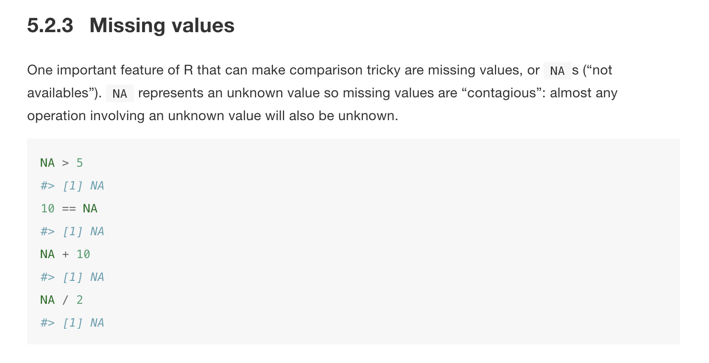

---
params:
  lesson: "Lesson 4"
  title: "Wrangling data with `dplyr`"
  bookchapter_name: "Section 5.2.3"    
  bookchapter_section: "https://r4ds.had.co.nz/transform.html#missing-values"
  functions: "`is.na`, `arrange`, `select`, `mutate`"
  packages: "`dplyr`"      
  # end inputs ---------------------------------------------------------------
header-includes: \usepackage{float}
always_allow_html: yes
output:
  html_document:
    code_folding: show
---
  
```{r, setup, echo = FALSE, cache = FALSE, include = FALSE}
options(width=100)
knitr::opts_chunk$set(
  eval = FALSE, # run all code
  echo = TRUE, # show code chunks in output 
  tidy = TRUE, # make output as tidy
  message = FALSE,  # mask all messages
  warning = FALSE, # mask all warnings 
  comment = "",
  tidy.opts=list(width.cutoff=100), # set width of code chunks in output
  size="small" # set code chunk size
  )
```
\

<!-- install packages -->
```{r, load packages, eval=T, include=T, cache=F, message=F, warning=F, results='hide',echo=F}
packages <- c("ggplot2","ggthemes","dplyr","tidyverse","zoo","RColorBrewer","viridis","plyr")   
if (require(packages)) {
    install.packages(packages,dependencies = T)
    require(packages)
    # load tvthemes
    devtools::install_github("Ryo-N7/tvthemes")
}
lapply(packages,library,character.only=T)  
```

<!-- ____________________________________________________________________________ -->
<!-- ____________________________________________________________________________ -->
<!-- ____________________________________________________________________________ -->
<!-- start body -->

# `r paste0(params$lesson,": ",params$title)`    
\  

Functions for `r params$lesson`  
`r params$functions`    
\    

Packages for `r params$lesson`          
`r params$packages`        
\    

# Agenda

[Data visualisation in `R` for Data Science, `r params$bookchapter_name`](`r params$bookchapter_section`).      
\  

<!--  end yaml template------------------------------------------------------- -->  
  
* Continue where we left off last time with more functions from the `dplyr` package. You'll use these functions to help wrangle data. 


# Do First    

1. Use the `nycflights13` data set and identify the flights that arrived more than 30 minutes late.     

```{r, include = FALSE, out.width="100%"}

library(nycflights13)
filter(flights, arr_delay > 30)
```


2. Identify flights that departed between midnight and 5am (inclusive).

```{r, include = FALSE}
# tricky because you have to figure out that 1,2,3 int means 00:01, 00:02 AM, etc. look at sched_dep_time and dep_delay

filter(flights, dep_time %in% c(2400, 1:500)) #OR 
filter(flights, dep_time==2400 | dep_time<=500)

```

\

# Today's approach

\

[See David Kane's philosophy on teaching data science here](https://www.davidkane.info/files/gov_1005_spring_2019.html)

\

<center>  </center>

\


# Tidying

<center></center>


# 5.2.3 Missing values

<center>  </center>

# Exercises

* 5.3.1 - `arrange`
* 5.4.1 - `select`
* 5.5.2 - `mutate`


