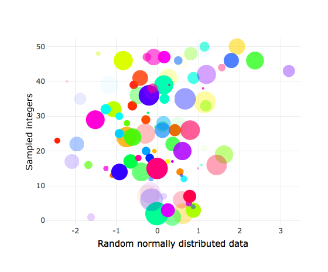

<!-- this enables math encoding in the knitted documents  -->
<script type="text/x-mathjax-config">
  MathJax.Hub.Config({ TeX: { equationNumbers: {autoNumber: "all"} } });
</script>
Date: 2019-10-28
R version: 3.5.0
\*Corresponding author: Your email here

Overview
========

This document showcases how to create and use `RMarkdown` documents.

You can easily create headings. This is a first order heading.
==============================================================

Then move down in heading order size
------------------------------------

### Like this subheading

#### And this fourth order heading

<!-- To create a new line of text, insert two spaces after every line in the `Rmd` file, then hit _ENTER_.         -->
You can write in **bold** and *italicised* text (in **two** different *ways*).

You can write in-line `code` if you want to differentiate between when you are typing normally or highlighting `model parameters`, for example.

Equations like this *t*′=*γ*(*t* − *v**x*/*c*<sup>2</sup>), to appear within text lines.

Create links to your [website](https://github.com/darwinanddavis).

Make footnotes[1].

Insert line breaks <br> between text like this, which works best in large <br> slabs of text

Insert a horizontal line break using five asterisks ('\*\*\*\*\*')

<!-- horizontal line  -->
<!-- PDF output doesn't like this: Missing number treated as zero error  -->
<!-- *****     -->
The raw Rmd file also has the code for inserting user comments. <!-- To do this, place the cursor on the text and type 'Cmd/Ctl + Shift + C' -->

(There is also a page break here. Best seen in PDF. Check the raw Rmd file to see the code)

<!-- page break  -->
Define equations
----------------

Accordingly, we write the eigenfunction of a spinless particle as the superposition of plane wave states of momentum (*π*) and energy (*E*<sub>*j*</sub>) having amplitudes *a*(*π*, *E*<sub>*j*</sub>) (from [\[1\]](https://arxiv.org/vc/quant-ph/papers/0607/0607001v1.pdf)).
$$
\\phi n(r,t) =
  \\sum\_{i, j} a(p\_{i},E\_{j})
  e^{
    \\frac{i}
    {h}
    (p\_{i} \\cdot r - E\_{j}t)
}
$$
  

Create, alter, and embed plots
------------------------------

<!-- -->

Figure 1. Example of a stock plot embedded into a PDF from RMarkdown.

Show plots with associated code
-------------------------------

``` r
suppressWarnings(require(viridis))
bm <- 0
par(las=1,bty="n"); xlim <- c(-5,5);ylim <- c(0,0.5)
set.seed(12)
N <- 2000
rr <- rnorm(N); rr2 <- rnorm(N^2); rr3 <- rnorm(N+0.3)
rrd <- density(rr);rrd2 <- density(rr2);rrd3 <- density(rr3)
main <- paste0(N," points but plot better");xlab <- "Points in space"
if(bm==1){
  layout(matrix(c(rep(1,3),2:4), 2, 3, byrow = TRUE));sc <- 1
  plot(rr,las=1,bty="n",col=adjustcolor(viridis(N),0.5),pch=20,cex=runif(10,1,5),
       main=main,xlab=xlab)
for(r in list(rrd,rrd2,rrd3)){
  plot(r,xlim=xlim,ylim=ylim,main="")
  polygon(r,col=adjustcolor(viridis(250)[sc],0.5),border=viridis(250)[sc]);sc <- sc+100}
}else{par(mfrow=c(1,1))
  plot(rr,las=1,bty="n",col=adjustcolor(viridis(N),0.5),pch=20,cex=runif(10,1,5),
       main=main,xlab=xlab)}
```

<!-- -->

Figure 2. Example of a plot with improved graphics and its associated code embedded into the output document from RMarkdown.

And tables
----------

Table 1. Definitions of model parameters for individual hosts and **parasites**. Dimensions and units: -, dimensionless; cm, centimetres; J, Joules; L, length.

| Parameter | Definition                    |  Dimension<br/>(unit)|
|:---------:|:------------------------------|---------------------:|
|    *L*    | structural length             |                    cm|
|    *ee*   | scaled reserve density        |    J (cm<sup>3</sup>)|
|    *D*    | host development              |                   ---|
|    *RH*   | energy in reproduction buffer |                     J|

Use buttons or tabs for sub-chapters
------------------------------------

### Chapter 1

. . . . .

*Then you can add whatever you want here* like you would normally write in the `Rmd` file.

. . . . .

### Chapter 2 (with new code)

Here's an Easter egg for you ...

<!-- -->

### More tables

Here's a new way of creating tables using the `DT` package

<!-- -->

<!-- *** -->
Embed code from different languages
-----------------------------------

### This is `R` code

``` r
if(pck==1){
  p<-c("rJava", "RNetLogo"); remove.packages(p)
  # then install rJava and RNetLogo from source
  install.packages("rJava", repos = "https://cran.r-project.org/")
  install.packages("RNetLogo", repos = "https://cran.r-project.org/")
}
```

### `shell/bash`

``` bash
echo "Hello Bash!"
pwd # check working dir
git init # initialise git
```

### Octave (and MATLAB from the `RMatlab` package).

[`RMatlab documentation`](https://cran.r-project.org/web/packages/R.matlab/index.html).

``` octave
b = [4; 9; 2] # Column vector
A = [ 3 4 5;
      1 3 1;
      3 5 9 ]
x = A \ b     # Solve the system Ax = b
```

### HTML

``` html
<!-- links-->
        <div class="footer">
            <a href="dd_feed.html"
            class="transition fade_in">
                Latest post
            </a>
            &nbsp; &nbsp; &nbsp;
            <a href="dd_contact.html"
            class="transition fade_in">
                Contact
            </a>
            &nbsp; &nbsp; &nbsp;
            <a href="dd_subscribe.html"
            class="transition fade_in">
                Subscribe
            </a>
        </div>
```

### CSS

``` css
# custom code for the tabs in this file
.btn {
    border-width: 0 0px 0px 0px;
    font-weight: normal;
    text-transform: ;
}
.btn-default {
    color: #f08080;
    background-color: #ffffff;
    border-color: #ffffff;
}
```

### Javascript to access `html` and `css`

``` js
$('.title').css('color', 'red')
```

### Python

``` python
x = 'hello, python world!'
print(x.split(' '))
```

### Here's a complete list of available languages

``` r
names(knitr::knit_engines$get())
```

    ##  [1] "awk"       "bash"      "coffee"    "gawk"      "groovy"   
    ##  [6] "haskell"   "lein"      "mysql"     "node"      "octave"   
    ## [11] "perl"      "psql"      "Rscript"   "ruby"      "sas"      
    ## [16] "scala"     "sed"       "sh"        "stata"     "zsh"      
    ## [21] "highlight" "Rcpp"      "tikz"      "dot"       "c"        
    ## [26] "fortran"   "fortran95" "asy"       "cat"       "asis"     
    ## [31] "stan"      "block"     "block2"    "js"        "css"      
    ## [36] "sql"       "go"        "python"    "julia"     "sass"     
    ## [41] "scss"

References
==========

\[1\] Efthimiades, S., Physical meaning and derivation of Schrodinger and Dirac equations, Department of Natural Sciences, Fordham University, [doi: d34464566](https://arxiv.org/vc/quant-ph/papers/0607/0607001v1.pdf).

[1] Here is the footnote you created earlier, automatically formatted
