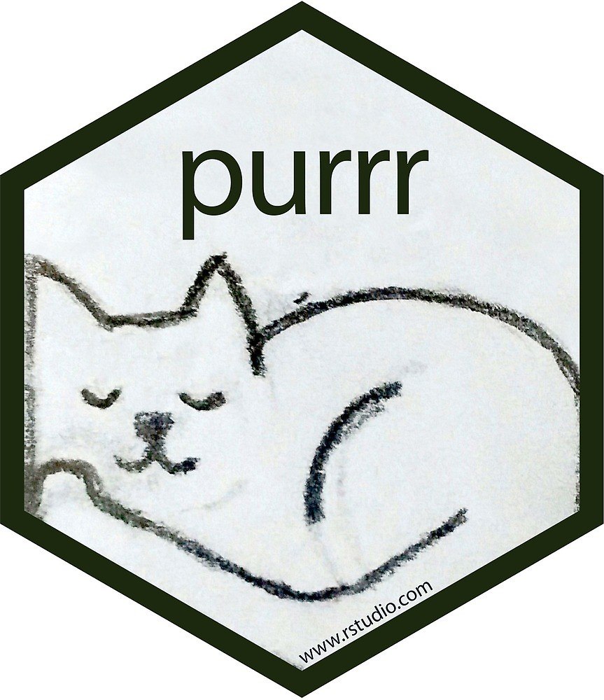

---
params:
  lesson: "Lesson 6"
  title: "Lists, lists, lists and applying functions with `purrr`"
  bookchapter_name: "Cheat sheet for the `purrr` package"    
  bookchapter_section: "https://purrr.tidyverse.org/"  
  functions: "`map`, `map2`"
  packages: "`dplyr`, `purrr`"      
  # end inputs ---------------------------------------------------------------
header-includes: \usepackage{float}
always_allow_html: yes
output:
  html_document:
    code_folding: show
---
  
```{r, setup, echo = FALSE, cache = FALSE, include = FALSE}
options(width=100)
knitr::opts_chunk$set(
  eval = FALSE, # run all code
  echo = TRUE, # show code chunks in output 
  tidy = TRUE, # make output as tidy
  message = FALSE,  # mask all messages
  warning = FALSE, # mask all warnings 
  comment = "",
  tidy.opts=list(width.cutoff=100), # set width of code chunks in output
  size="small" # set code chunk size
  )
```
\

<!-- install packages -->
```{r, load packages, eval=T, include=T, cache=F, message=F, warning=F, results='hide',echo=F}
packages <- c("ggplot2","ggthemes","dplyr","tidyverse","zoo","RColorBrewer","viridis","plyr")   
if (require(packages)) {
    install.packages(packages,dependencies = T)
    require(packages)
    # load tvthemes
    devtools::install_github("Ryo-N7/tvthemes")
}
lapply(packages,library,character.only=T) 
```

<!-- ____________________________________________________________________________ -->
<!-- ____________________________________________________________________________ -->
<!-- ____________________________________________________________________________ -->
<!-- start body -->

# `r paste0(params$lesson,": ",params$title)`    
\  

Functions for `r params$lesson`  
`r params$functions`    
\    

Packages for `r params$lesson`          
`r params$packages`        
\    

# Agenda 

Use the `purrr` package to apply functions to lists and vectors.    

[`r params$bookchapter_name`](`r params$bookchapter_section`).      
\  

<!-- ----------------------- image --------------------------- -->
<div align="center">
  
</div>
<!-- ----------------------- image --------------------------- -->
\    

<!--  end yaml template------------------------------------------------------- -->  

# Do First    

Recreate the below plot using the smaller NYC Airbnb dataset. The curve is a 'loess'. To change the legend title, add the (unintuitive) `colour = "your legend title"` argument to the `labs()` function.  

```{r}
# smaller csv file (16 cols)
url <- "http://data.insideairbnb.com/united-states/ny/new-york-city/2019-06-02/visualisations/listings.csv"
nyc <-  readr::read_csv(url)
nyc <- nyc[nyc$id < 1000000,] # get smaller subet of data
```

```{r, echo=F, eval=T, out.width="100%"}
require(ggthemes,ggplot2,readr)

# smaller csv file (16 cols)
url <- "http://data.insideairbnb.com/united-states/ny/new-york-city/2019-06-02/visualisations/listings.csv"
nyc <-  read_csv(url)
nyc <- nyc[nyc$id < 1000000,] # get smaller subet of data

colv = "#00060a"
ggplot(data = nyc, mapping = aes(x = reviews_per_month,y = number_of_reviews)) +
  geom_point(aes(color=neighbourhood_group),show.legend = T,alpha=0.5) +
  geom_smooth(color = colv, fill = colv, method="loess",alpha=0.3) +
  labs(title = "Reviews across NYC boroughs",
       caption = "Source: NYC Airbnb data",
       x = "Reviews per month",
       y =  "Number of reviews",
       colour = "Boroughs") +
  theme_classic()

```

# Create some data in a list  
  
First generate some random data  
```{r,eval=T}
s1 <- sample(10) # random number sample
s2 <- rnorm(10,500) # sample 10 normally distributed random numbers around a mean of 500 
s3 <- runif(10) # random uniform distribution
s1
s2
s3
```

Now combine these into a list using `list()`    
```{r,eval=T}
ls1 <- list(s1,s2,s3) # create a list of these data
ls1
ls1 %>% str
```
# Exercise 0  
## List indexing  
Print the `ls1` list object and take note of the index and elements   
```{r}
ls1

# index
ls1[1]
ls1[2]
ls1[3]

# elements
ls1[[1]][[1]]
ls1[[1]][[3]]
ls1[[2]][[10]]
ls1[[3]][[11]] # ??
ls1[[3]] %>% length

# what's the difference?
ls1[1]
ls1[[1]]

```

## Apply functions  

The `purrr` package uses the following apply functions to apply function iteratively to a list or vector.    

`map` Apply a function to each element of a list  

```{r}
require(purrr)
set.seed(12) # set a number seed to generate reprodicible results for random data  
map(ls1,mean)  # get the mean 
```
## Exercise 1  
Apply summary stats to the `ls1` list data    
* `sum`  
* `summary`  
* `max`  
* `sqrt`  
* `length` and `lengths`      

What happens when you run the following and why?  
```{r}
mean(ls1)
sum(ls1)  
```
\    

# Exercise 2  
## Filter lists 
`pluck` Select an element by name or index  
`keep` Select elements that pass a logical test   
`discard` Select elements that do not pass a logical test  
`compact` Drop empty elements  

```{r,eval=F}
pluck(ls1,3) # advantage = returns numeric 
ls1[3][[1]] # this is the same as above

func <- map(ls1,mean) > 10 # create a logical test (a predicate function)  
keep(ls1, func)
discard(ls1, func)

ls2 <- list(1,NA,NULL,integer(0),list()) # list of empty and null things  
compact(ls2)

```

Store plots in lists for easy retrieval. Create two plots of the `ls1` data (called `ls1p` and `ls2p`) and store in a list called `plot_list`.      
```{r,echo=F,eval=T}
set.seed(10)
ls1_df <- ls1 %>% 
  data.frame

# create some plots 
names(ls1_df) <- c("A","B","C")
ls1p <- ggplot(ls1_df,aes(A,B,size=A))+geom_point(color="orange",show.legend = F) + geom_line(color="orange",show.legend = F) + labs(title="Access plots as list indices") + theme_minimal()
ls2p <- ggplot(ls1_df)+geom_point(aes(A,C,color=A,size=A),show.legend = F) + theme_minimal()
# store in list
plot_list <- list(ls1p,ls2p) 
```

```{r,eval=F}
plot_list <- list(ls1p,ls2p) 
```

PLot the below plot from the object `plot_list`    
```{r,echo=F,eval=T}
# pluck individual plots from list  
pluck(plot_list,1)

```


# Exercise 3
## Summarise lists    

`every` Do all elements pass a test?   
`some` Do some elements pass a test?  
`has_element` Does a list contain an element?  
`detect` Find first element to pass  
`detect_index` Find index of first element to pass  
`vec_depth` Return depth (number of levels of indexes)  
  
```{r, eval=F}
ls1 %>% every(is.character)
ls1 %>% some(is.character)
ls1 %>% has_element("foo")
ls1 %>% detect(is.character)
ls1 %>% detect_index(is.character)
ls1 %>% vec_depth
 
```

# Exercise 4 
## Transform lists   

`modify` Apply function to each element  
`modify_at` Apply function to elements by name or index  
`modify_if` Apply function to elements that pass a test  
`modify_depth` Apply function to each element at a given level of a list  
```{r}

```

# Further useful `purrr` functions   
  
`pmap` Apply a function to groups of elements from lists of lists    
`lmap` Apply function to each list-element of a list or vector      
`imap` Apply function to each element of a list or vector and its index   
