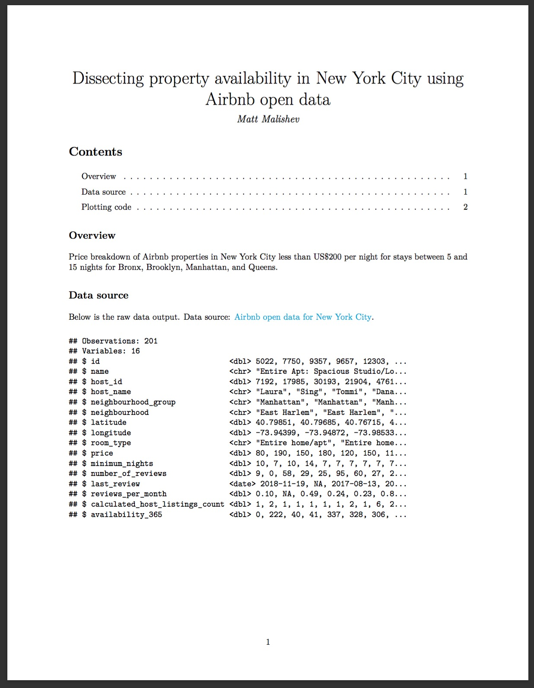
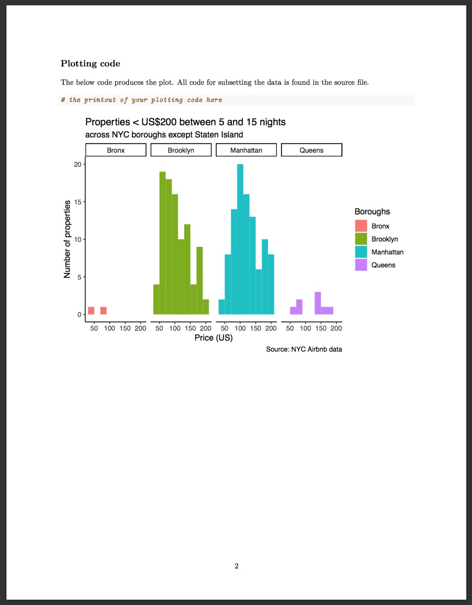

---
params:
  lesson: "Lesson 7"
  title: "Importing diverse data like a pro"  
  bookchapter_name: "Cheat sheet for the `readr` package"    
  bookchapter_section: "https://readr.tidyverse.org/"    
  functions: "`read_csv`, `read_delim`, `write_csv`, `complete`, `expand`"
  packages: "`readr`"      
  # end inputs ---------------------------------------------------------------
header-includes: \usepackage{float}
always_allow_html: yes
output:
  html_document:
    code_folding: show
---
  
```{r, setup, echo = FALSE, cache = FALSE, include = FALSE}
options(width=100)
knitr::opts_chunk$set(
  eval = FALSE, # run all code
  echo = TRUE, # show code chunks in output 
  tidy = TRUE, # make output as tidy
  message = FALSE,  # mask all messages
  warning = FALSE, # mask all warnings 
  comment = "",
  tidy.opts=list(width.cutoff=100), # set width of code chunks in output
  size="small" # set code chunk size
  )
```
\  

<!-- install packages -->
```{r, load packages, eval=T, include=T, cache=F, message=F, warning=F, results='hide',echo=F}
packages <- c("ggplot2","ggthemes","dplyr","tidyverse","zoo","RColorBrewer","viridis","plyr")   
if (require(packages)) {
    install.packages(packages,dependencies = T)
    require(packages)
    # load tvthemes
    devtools::install_github("Ryo-N7/tvthemes")
}
lapply(packages,library,character.only=T)  
```

<!-- ____________________________________________________________________________ -->
<!-- ____________________________________________________________________________ -->
<!-- ____________________________________________________________________________ -->
<!-- start body -->

# `r paste0(params$lesson,": ",params$title)`    
\  

Functions for `r params$lesson`  
`r params$functions`    
\    

Packages for `r params$lesson`          
`r params$packages`        
\    

# Agenda 

Use the `readr` package to easily read in different data file types.      

[`r params$bookchapter_name`](`r params$bookchapter_section`).      
\  

<!-- ----------------------- image --------------------------- -->
<div align="center">
  
</div>
<!-- ----------------------- image --------------------------- -->
\    


<!--  end yaml template------------------------------------------------------- -->  

# Do First    

Recreate the below PDF using `RMarkdown` with the following conditions from the smaller NYC Airbnb dataset. [Download the final PDF file here](https://raw.githubusercontent.com/darwinanddavis/EmoRyCodingClub/master/Lesson7_dofirst.pdf).  

```{r}
# smaller csv file (16 cols)
url <- "http://data.insideairbnb.com/united-states/ny/new-york-city/2019-06-02/visualisations/listings.csv"
nyc <-  readr::read_csv(url)
nyc <- nyc[nyc$id < 1000000,] # get smaller subet of data
```

* Accommodation less than $200 per night, between 5 and 15 nights, and excluding Staten Island.        
* Show only the data structure of the above subsetted data as a code output. No need to show the code for how you subsetted the data (see the PDF).       
* Show the plotting code along with the plot.      
* Use the below `yaml` for your `Rmd` file.      
```{yaml, echo=T, eval=F,message=F}

---
title: "Dissecting property availability in New York City using Airbnb open data"
author: "<your name here>"
urlcolor: blue
params:
  source: "http://insideairbnb.com/new-york-city/"
output:
  pdf_document:
    toc: yes
    toc_depth: 2
---
      
```
* Append the below code at the beginning of your `Rmd` file to load the appropriate packages and suppress the package loading messages and warnings. Use a `{r, echo=T, eval=T, message=F}` header in the code chunk.     
```{r, echo=T, eval=T,message=F}
pacman::p_load(ggthemes,ggplot2,readr,dplyr)
```


<!-- ----------------------- image --------------------------- -->
 
<!-- ----------------------- image --------------------------- -->
\  

*****    

# Reading in different data file types      
  
```{r, eval=F}
read_csv("file.csv")  
write_file(x = "a,b,c\n1,2,3\n4,5,NA", path = "file.csv")  
read_csv2("file2.csv")  
write_file(x = "a;b;c\n1;2;3\n4;5;NA", path = "file2.csv")
read_delim("file.txt", delim = "|")  
write_file(x = "a|b|c\n1|2|3\n4|5|NA", path = "file.txt")
read_fwf("file.fwf", col_positions = c(1, 3, 5)) write_file(x = "a b c\n1 2 3\n4 5 NA", path = "file.fwf")
read_tsv("file.tsv") Also read_table().
write_file(x = "a\tb\tc\n1\t2\t3\n4\t5\tNA", path = "file.tsv")  
```
\  

# Saving your data from `R`    
Save `x`, an `R` object, to `path`, a file path  
```{r,eval=F}
# Comma delimited file
write_csv(x, path, na = "NA", append = FALSE, col_names = !append)
# File with arbitrary delimiter
write_delim(x, path, delim = " ", na = "NA", append = FALSE, col_names = !append)
# CSV for excel
write_excel_csv(x, path, na = "NA", append = FALSE, col_names = !append)
# String to file
write_file(x, path, append = FALSE) String vector to file, one element per line
write_lines(x,path, na = "NA", append = FALSE) Object to RDS file
write_rds(x, path, compress = c("none", "gz", "bz2", "xz"), ...)
# Tab delimited files
write_tsv(x, path, na = "NA", append = FALSE, col_names = !append)
```
