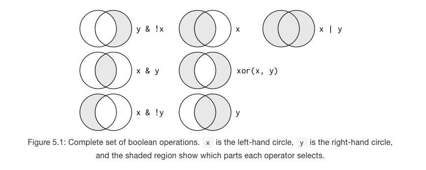

```{r}
start <- Sys.time()

#load packages

library(tidyverse)

# readr???

```


```{r}
url <- "http://data.insideairbnb.com/united-states/ny/new-york-city/2019-06-02/visualisations/listings.csv"
nyc <- read_csv(url)
nyc <- nyc[nyc$id < 1e+06, ]  # get smaller subet of data
my_variable
```

# Do first

```{r}
glimpse(nyc)
```

```{r}
ggplot(data=nyc) +
  geom_point(mapping=aes(x=minimum_nights, y=price, color = neighbourhood_group), show.legend = FALSE) +
  facet_wrap(neighbourhood_group, nrow=1) +
  theme_classic()

#not correct
```

```{r}
do.first <- Sys.time()
do.first-start
```

# R Project

Say which project we're going to work in today


# Basics in R

```{r}
x <- 3*4

#??

this_is_a_really_long_name <- 2.5
r_rocks <- 2 ^3


```

12:16

```{r}
my_variable <- 10
my_varıable
```


2. Tweak each of the following R commands so that they run correctly:

```{r}
library(tidyverse)

ggplot(data = mpg) + 
  geom_point(mapping = aes(x = displ, y = hwy)) # not sure what's wrong??

filter(mpg, cyl == 8) #misspelling of filter
filter(diamonds, carat > 3) #diamonds, not diamond
```
12:22


# Chapter 5 Transformations
12:54

```{r}
#install.packages("nycflights13")
library(nycflights13)

flights

```


```{r}
jan1 <- filter(flights, month == 1, day == 1)

```

##5.2.2 Logical Operators


```{r}
# november or december
filter(flights, month == 11 | month == 12)

```

```{r}
# not --> b/c shows only jan when 11|12 means tRUE
filter(flights, month == 11 | 12)

```

```{r}

# x %in% y, where it finds every row that has a value in y

 nov_dec <- filter(flights, month %in% c(11, 12))
```


```{r}

# DeMorgan's law 
# !(x&y) is the same as !x | !y 
# !(x|y) is the same as !x & !y

filter(flights, !(arr_delay > 120 | dep_delay > 120))
filter(flights, arr_delay <= 120, dep_delay <= 120)

```

```{r}

# DeMorgan's law 
# !(x&y) is the same as !x | !y 
# !(x|y) is the same as !x & !y

filter(flights, !(arr_delay > 120 | dep_delay > 120))
filter(flights, arr_delay <= 120, dep_delay <= 120)

```

# 5.2.4 Exercises
2:24

1. Find all flights that

1.1 Had an arrival delay of two or more hours

```{r}
filter(flights, arr_delay >= 120)
```

1.2 Flew to Houston (IAH or HOU)

```{r}
filter(flights, dest %in% c("IAH", "HOU"))
```

1.3 Were operated by United, American, or Delta

```{r}
filter(flights, carrier %in% c("UA", "AA", "DL"))
```

1.4 Departed in summer (July, August, and September)

```{r}
filter(flights, month %in% c(7:9))
```

1.5 Arrived more than two hours late, but didn’t leave late

```{r}
filter(flights, arr_delay >= 120 & dep_delay<=0)
```

1.6 Were delayed by at least an hour, but made up over 30 minutes in flight

```{r}
filter(flights, dep_delay >= 60 & arr_delay < dep_delay-30)
```
2:40

1.7 Departed between midnight and 6am (inclusive)

```{r}
# tricky because you have to figure out that 1,2,3 int means 00:01, 00:02 AM, etc. look at sched_dep_time and dep_delay

filter(flights, dep_time %in% c(2400, 1:600)) #OR 
filter(flights, dep_time==2400 | dep_time<=600)
```


2. Another useful dplyr filtering helper is between(). What does it do? Can you use it to simplify the code needed to answer the previous challenges?

`between()` takes a vector and gets numbers in between a certain range...

```{r}

# Not sure what the solution is here

#filter(flights, dep_time==2400 | between(flights$dep_time, 1, 600))


filter(flights, dep_time==2400 | between(dep_time, 1, 600))


```

3. How many flights have a missing dep_time? 
    What other variables are missing? 
    What might these rows represent?

```{r}

filter(flights, is.na(dep_time))

#8255


```
Other variables missing for these flights are delay, arr_time, and air_time. These flights were likely cancelled.

3:06


4. Why is NA ^ 0 not missing? Why is NA | TRUE not missing? Why is FALSE & NA not missing? Can you figure out the general rule? (NA * 0 is a tricky counterexample!)

* NA is a unknown value, so sometimes the answer isn't missing...
```{r}

NA ^ 0 #any number is still going to be 1 here
NA | TRUE # one TRUE in an "or" statement will still give TRUE
FALSE & NA # one FALSE in an "and" statement will still give a FALSE

NA * 0 # not all numbers time 0 = 0. For example, 0*infinity is an undefined real #. Proofs are out there.

```

3:15

# 5.2 Arrange

1. How could you use arrange() to sort all missing values to the start? (hint: use is.na())

```{r}

arrange(flights, desc(is.na(dep_time)))

```

2. Sort flights to find the most delayed flights. 
   Find the flights that left earliest.

```{r}
 # most delayed
arrange(flights, desc(dep_delay))

# earliest 
arrange(flights, dep_delay)


```

3. Sort flights to find the fastest flights.

```{r}
 # fastest 
arrange(flights, air_time)

```

4. Which flights travelled the longest? Which travelled the shortest?

```{r}
 # longest
arrange(flights, desc(distance))

```
# cheat sheet

- 
- 
- 

#  introduce filter, live coding example

# checking in.....10 minute, 15 mintue

# 


