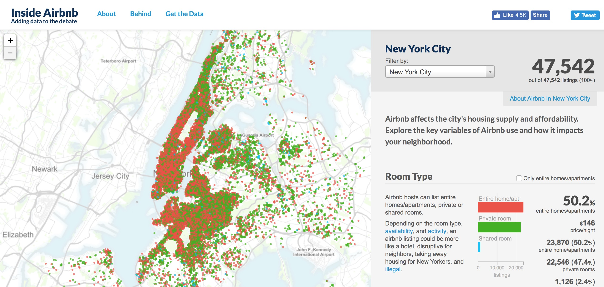

<!-- ---------------------------------------------------------------- -->
<!-- ----------------------- rmd settings --------------------------- -->
<!-- ---------------------------------------------------------------- -->

```{r klippy, echo=FALSE, include=TRUE}
# klippy::klippy()
```

<!-- rmd settings -->
```{r, set-options, echo = FALSE, cache = FALSE}
options(width=100)
knitr::opts_chunk$set(
 eval = TRUE, # run all code
 # echo = FALSE, # show code chunks in output 
 comment = "",
 tidy.opts=list(width.cutoff=100), # set width of code chunks in output
 tidy=TRUE, # make output as tidy
 message = FALSE,  # mask all messages
 warning = FALSE, # mask all warnings 
 size="small", # set code chunk size
 knitr::opts_chunk$set(fig.pos = 'H')
)
```

<!-- install packages -->
```{r, load packages, include=T, cache=F, message=F, warning=F, results='hide',echo=F}
packages <- c("ggplot2","dplyr","tidyverse","zoo","RColorBrewer","viridis","plyr","leaflet")   
if (require(packages)) {
    install.packages(packages,dependencies = T)
    require(packages)
}
lapply(packages,library,character.only=T)
```

<!-- ---------------------------------------------------------------- -->
<!-- ---------------------------------------------------------------- -->
<!-- ---------------------------------------------------------------- -->
\  
\  

<!-- ----------------------- overview --------------------------- -->
## Overview    
This page contains all the documents, links, and information for the monthly `R` coding club held in the Department of Biology, Emory University. We meet monthly and introduce new coding concepts and techniques in a casual working environment. The club is half lesson half workshop style and caters for all coding, `R`, and research levels.  
\  
\  
  
## Organisers  

**Matt Malishev, Department of Biology**    
**Desiree de Leon, Yerkes National Primate Research Center**  
**Hasse Walum, Yerkes National Primate Research Center**    

\  
\  
<!-- ----------------------- image --------------------------- -->
<div align="center"; text-align:center>
  
  
  
</div>
<!-- ----------------------- image --------------------------- -->
\    

## Date for next session  
July 11, 2019      
4:00 - 6:00 PM       
\  

## Location   
Room 2052  
Wayne Rollins Building  
\  

```{r,echo=F}
require(leaflet)
latlon <- c(33.79667, -84.32346) # emory
ecc_label <- "Room 2052, Wayne Rollins Building"
map <- leaflet() # initiate the leaflet map object
map <- addTiles(map) # add the actual map tiles to the leaflet object
map <- addMarkers(map,latlon[2],latlon[1],label=ecc_label,popup=ecc_label) 
map 

```


<br>
\  
  
<!-- ----------------------- 1 before arrival --------------------------- -->
# Before you arrive
Everyone needs to have the following software and packages loaded before you come to the first session. That way, we can get straight into it.     
  

* [Install `R` from CRAN](https://www.r-project.org/). 
 + If you're asked to choose a CRAN mirror, just choose whichever is closest to your location.  
* [Install `RStudio` Desktop](https://www.rstudio.com/products/rstudio/download/)
* Install the `tidyverse` package and then load it by copying and pasting the following code into the *Console* of `RStudio` and then pressing *Enter* to execute it.

```{r, eval= FALSE}
install.packages("tidyverse")
install.packages("ggplot2")
library(tidyverse)
library(ggplot2)
```

\  
\  

### If you have used `R` previously, you can skip to ['Learning Objectives'](#sec3).  

\  
\  

<br>

<!-- ----------------------- 2 pre check --------------------------- -->
# Pre-work questions  
If you're brand new to `R` or coding, familiarise yourself with a few basic things about `R Studio` and coding in `R`. The exercise below should take less than 5 minutes.    

Once you have installed `R` and `R Studio`, copy and paste the code below into the `R Studio` *Console* (or try typing it out yourself) and press *Enter* to run it.  

```{r, eval = FALSE}

# Calculate something simple
2 + 2

# Calculate something using built-in constants
2 * pi

```

<br>

Use the *assignment operator*, `<-`, to create new objects in `R`

```{r, eval = FALSE}

a <- 2 + 2
b <- a * pi
c <- "Hello World"
```

And then print the objects in the console:

```{r, eval = FALSE}
a 
b
c
```

<!-- ----------------------- 3 learning obj --------------------------- -->
<a id="sec3"></a>  

# Learning Objectives

Our first EmoRy Coding Club will be primarily targeted towards beginners, but we hope this will also useful for anyone who may already be familiar with base `R` and wanting better practice with the `tidyverse` package.  

1) Introducing beginners to the `RStudio` IDE
2) Doing some introductory plotting with `ggplot`

We will use the [R for Data Science](https://r4ds.had.co.nz/index.html) free online text to guide us through learning `R`.


<!-- ----------------------- image --------------------------- -->
<div align="center"; text-align:center>
  
</div>
<!-- ----------------------- image --------------------------- -->


<br>

<!-- ----------------------- 4 materials --------------------------- -->
# Materials

We'll be diving into [Ch 3, Data visualisation](https://r4ds.had.co.nz/data-visualisation.html) and working through Section 3.3.1.
\  

### The dataset    
We'll also be using [open-access data of housing listings from AirBnb](http://insideairbnb.com/new-york-city/) as our toy dataset. Once we've completed the above **R for Data Science exercises**, we'll repeat the plotting exercise using these data.      
\  

We'll be using this dataset for the rest of the club sessions, so feel free to explore it in your own time.      
\  
\  

<!-- ----------------------- image --------------------------- -->
<div align="center"; text-align:center>
  
</div>
<!-- ----------------------- image --------------------------- -->  
  

This is a really big data set (it has ~50k rows !!), so it will take a moment to run. To import the AirBnb data from the URL, copy and paste the lines of code below in your `R` console and press *Enter*.   

```{r, eval = FALSE}
require(readr)
url <- "http://data.insideairbnb.com/united-states/ny/new-york-city/2019-06-02/data/listings.csv.gz"

nyc_full <-  read_csv(url)

# smaller csv file (16 cols)
url <- "http://data.insideairbnb.com/united-states/ny/new-york-city/2019-06-02/visualisations/listings.csv"
nyc <-  read_csv(url)
nyc <- nyc[nyc$id < 1000000,] # truncate dataset 

head(nyc[,1:5])

```

If everything worked correctly, you should see the below ouput printed in your `R` console.  

```{r, echo=F, eval=T}
# smaller csv file (16 cols)
url <- "http://data.insideairbnb.com/united-states/ny/new-york-city/2019-06-02/visualisations/listings.csv"
nyc <-  read_csv(url)
nyc <- nyc[nyc$id < 1000000,] # truncate dataset 

head(nyc[,1:5])

```

```{r, echo =FALSE, }
# devtools::install_github('yihui/xfun')

# a single RmD file
# xfun::embed_file('example.Rmd')

# embed a single csv file
 # r xfun::embed_file('data.csv')` 

```
  